# TRPG Application - Interaction Flowcharts and State Diagrams

## Document Overview

This document provides detailed flowcharts and state diagrams for key interaction patterns in the TRPG application. These diagrams serve as visual guides for developers and UX designers implementing user interactions.

## Character Creation Flow

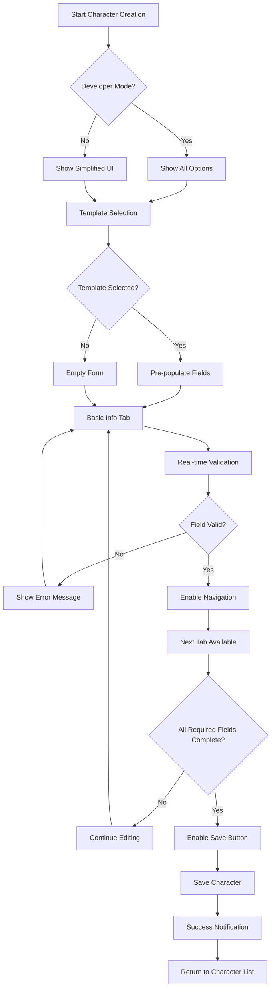

## Dice Rolling Interaction Flow

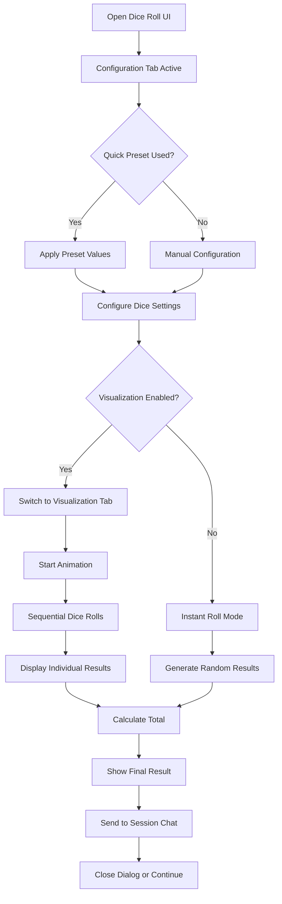

## AI Chat Integration Flow

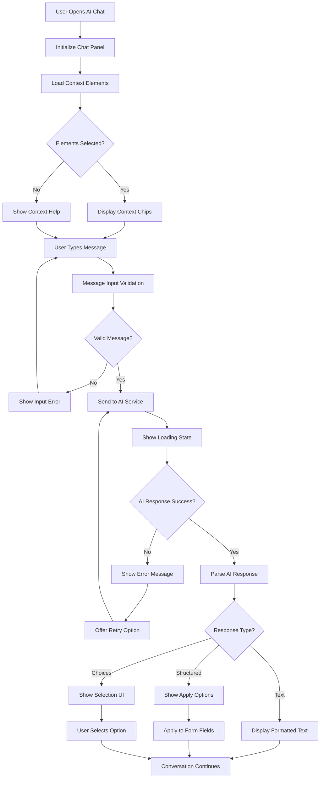

## Timeline Event Management Flow

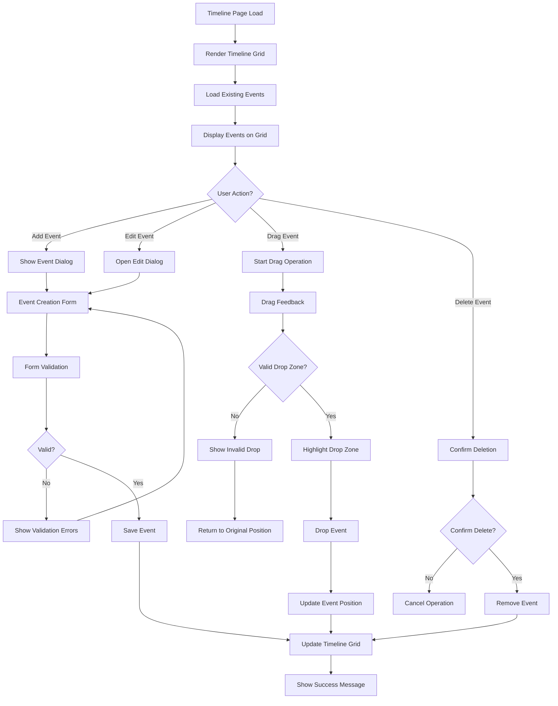

## Form Validation State Machine

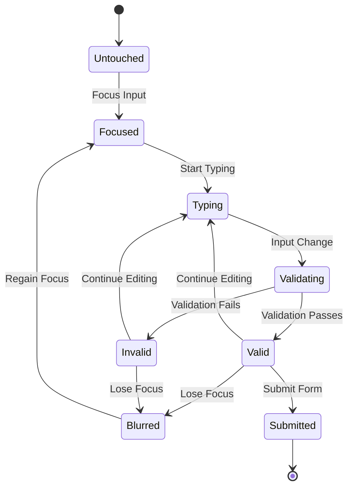

## Navigation State Flow

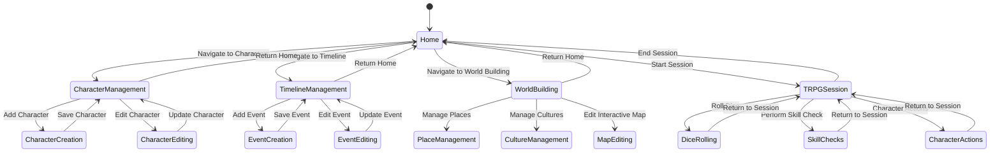

## AI Auto-complete Flow

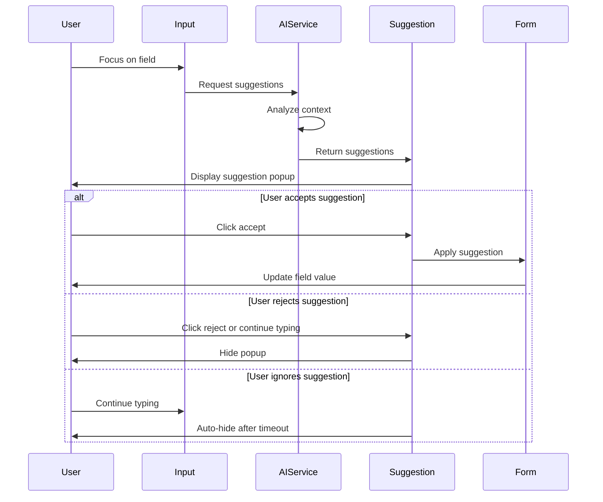

## Error Handling Flow

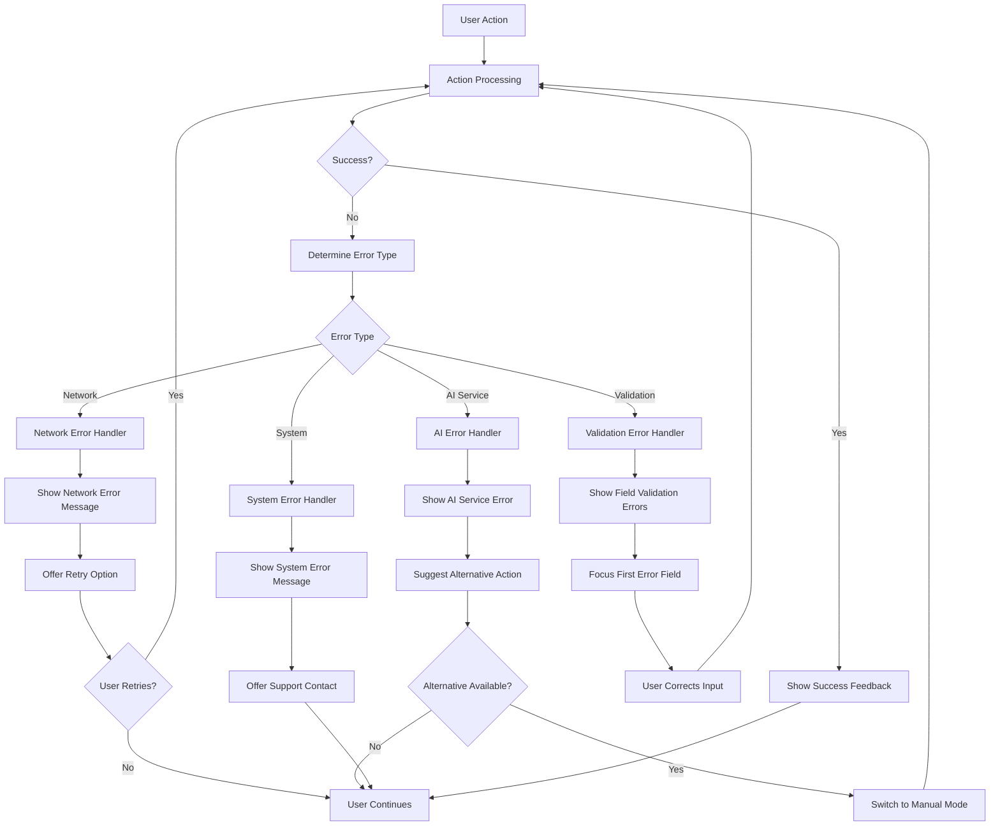

## Mobile Touch Interaction Flow

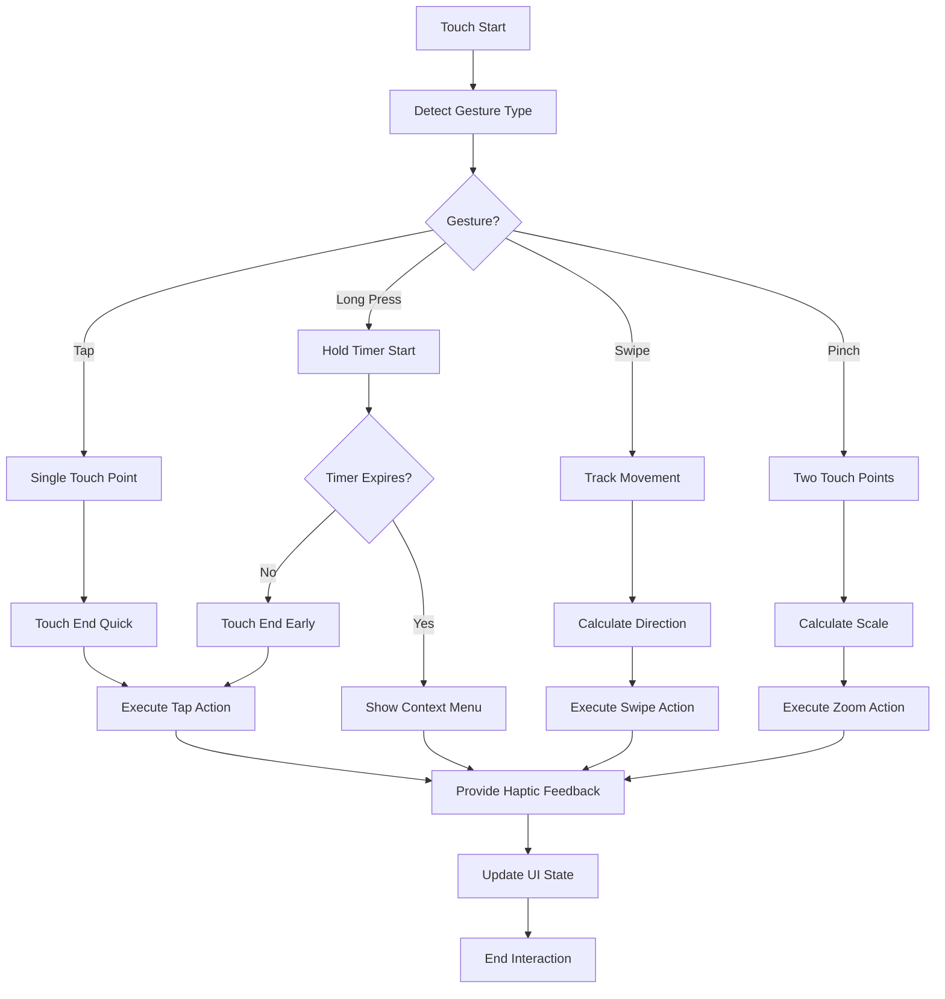

## Accessibility Navigation Flow

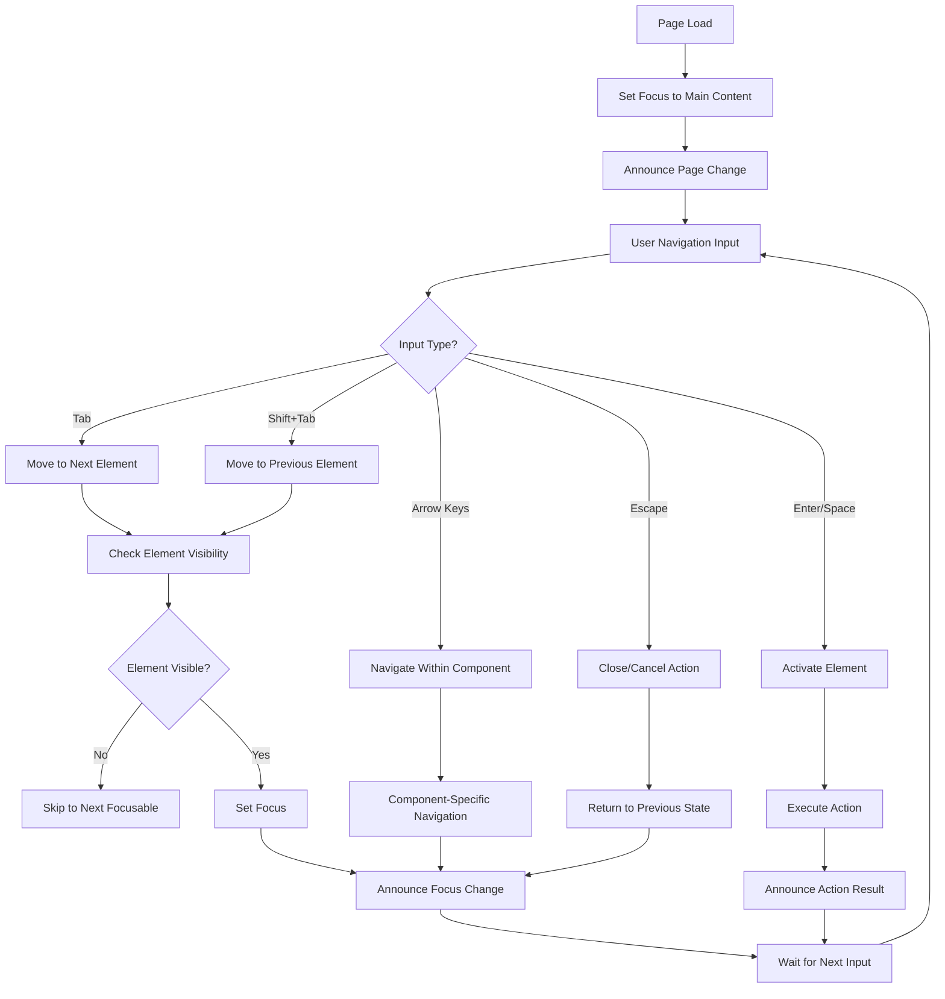

## Session State Management Flow

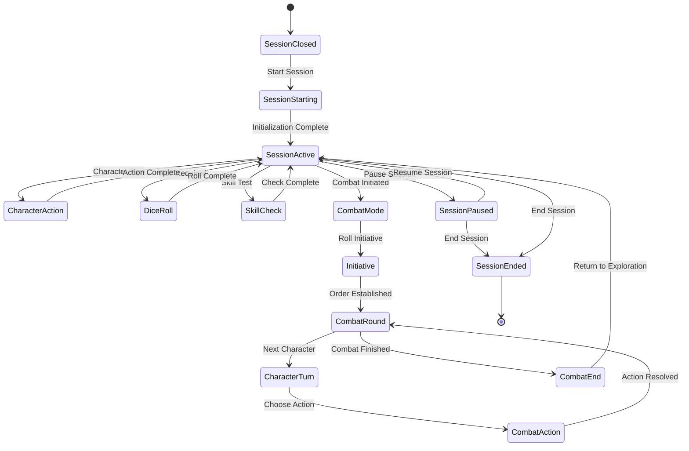

## World Building Tab Navigation

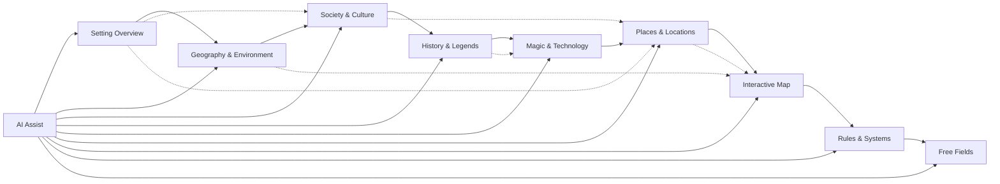

## Character Status Change Flow

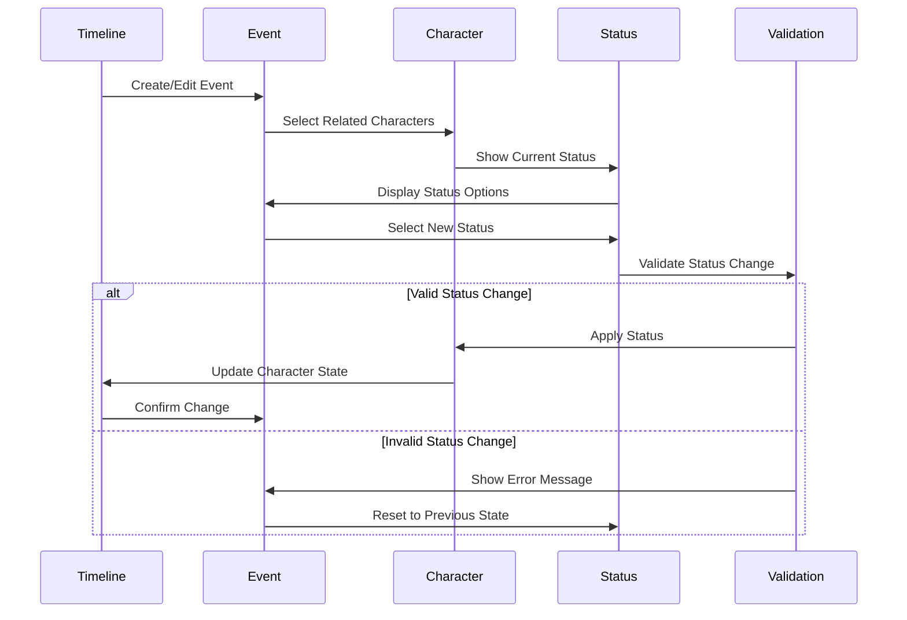

This comprehensive set of flowcharts and state diagrams provides visual guidance for implementing the complex interaction patterns in the TRPG application. These diagrams should be referenced during development to ensure consistent and predictable user experiences across all features.