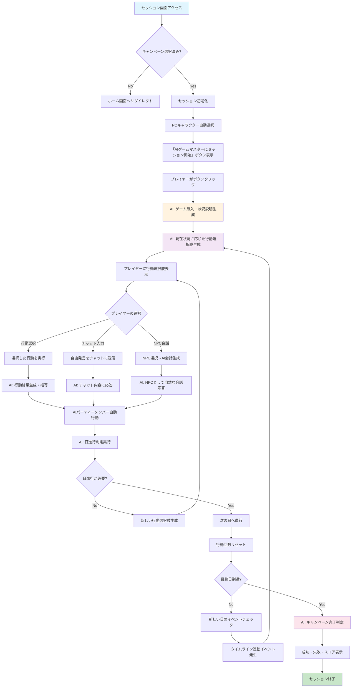
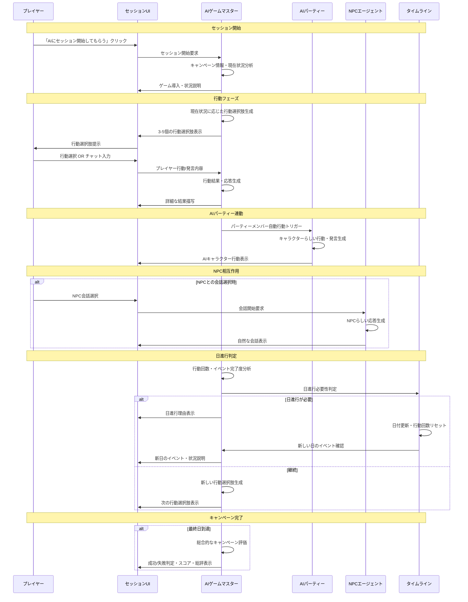
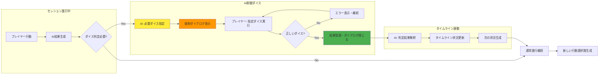
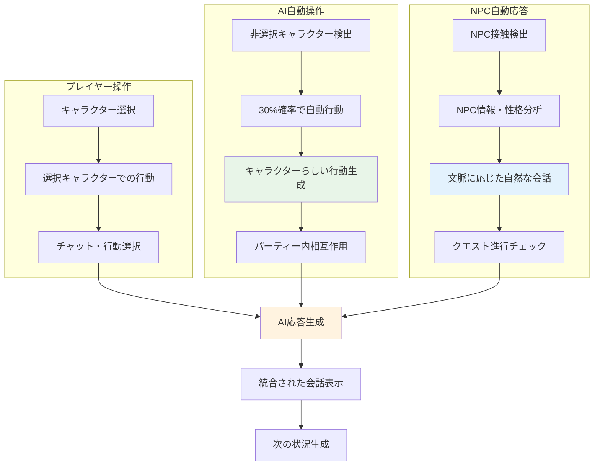
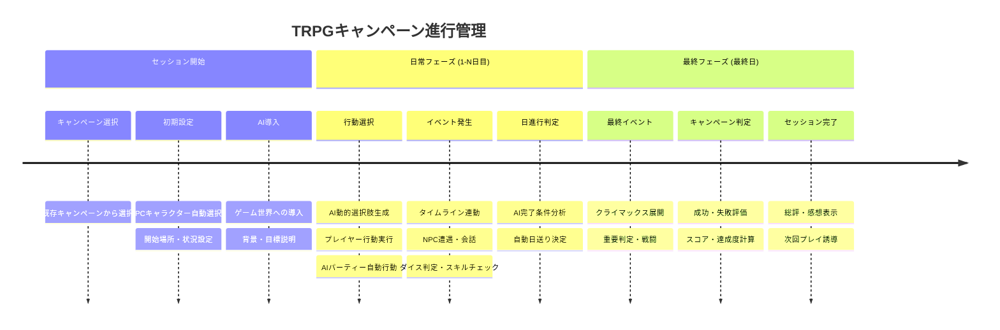

# TRPG AI エージェント GM プロジェクト仕様書

## プロジェクト概要

### 基本情報

- **プロジェクト名**: TRPG AI エージェント GM
- **目的**: AI を活用した TRPG（テーブルトップロールプレイングゲーム）キャンペーン管理・実行システム
- **対象ユーザー**: TRPG プレイヤー、ゲームマスター、シナリオ作成者
- **技術スタック**: React 18, TypeScript, Material-UI, Express.js, SQLite + Litestream, Google Cloud Run

### システム概要

本システムは、AI エージェントがゲームマスター（GM）として機能し、プレイヤーが TRPG セッションを体験できる Web アプリケーションです。キャンペーン設計からセッション実行まで、包括的な TRPG サポートを提供します。

## 技術アーキテクチャ

### インフラストラクチャ

- **デプロイ先**: Google Cloud Run（マルチサービス構成）
- **フロントエンド**: React SPA（Cloud Run）
- **バックエンド**: Express.js API（Cloud Run）
- **データベース**: SQLite + Litestream（自動バックアップ）
- **ストレージ**: Google Cloud Storage（画像・アセット）
- **AI 統合**: OpenAI, Anthropic Claude, Google Vertex AI

### モノリポ構成

```
/
├── apps/
│   ├── frontend/          # React 18 フロントエンド
│   └── proxy-server/      # Express.js バックエンド
├── packages/
│   └── types/            # 共有TypeScript型定義
└── docs/                 # 仕様書・ドキュメント
```

## データモデル・型定義

### クエストとイベントの分離概念

#### クエスト（Quest）
- **特徴**: ユーザーが能動的に選択・受注する依頼
- **発生条件**: 
  - NPCとの会話
  - 酒場のクエストボード確認
  - 特定のアイテム発見
- **管理**: PlotPageで一覧表示・進捗管理
- **報酬**: 明確な報酬が設定される

#### イベント（TimelineEvent）  
- **特徴**: 特定の場所・時間に自動発生する世界の出来事
- **発生条件**:
  - 特定の日時・場所に到達
  - プレイヤーの位置・行動
  - 前提イベントの完了
- **管理**: TimelinePageでタイムライン上に配置
- **影響**: ストーリー進行、世界状態変化
- **イベントタイプ**:
  - **combat**: 戦闘イベント
  - **social**: 社交・会話イベント
  - **exploration**: 探索イベント
  - **environmental**: 環境変化（天候、災害など）
  - **story**: ストーリー進行イベント
  - **trap**: トラップ（罠）イベント

### 核となる TRPG 型定義

#### TRPGCampaign（キャンペーン）

```typescript
interface TRPGCampaign {
  id: string;
  title: string;
  synopsis: string;
  gameSystem: string;
  maxPlayers: number;
  characters: TRPGCharacter[];
  enemies: EnemyCharacter[];
  npcs: NPCCharacter[];
  bases: BaseLocation[];
  quests: Quest[];
  events: TimelineEvent[]; // タイムライン上の自動発生イベント
  sessions: GameSession[];
  worldBuilding: WorldBuildingData;
  rules: CampaignRule[];
  imageUrl?: string;
  created_at: string;
  updated_at: string;
}
```

#### TRPGCharacter（Stormbringer ベース）

```typescript
interface TRPGCharacter {
  id: string;
  name: string;
  profession: string;
  gender: string;
  age: number;
  nation: string;
  religion: string;
  player: string;
  characterType: "PC" | "NPC";

  // 基本能力値
  attributes: {
    STR: number; // 筋力
    CON: number; // 耐久力
    SIZ: number; // 体格
    INT: number; // 知性
    POW: number; // 魔力・意志力
    DEX: number; // 器用さ
    CHA: number; // 魅力
  };

  // 派生値
  derived: {
    HP: number; // ヒットポイント
    MP: number; // マジックポイント
    SW: number; // Strike Rank（先制値）
    RES: number; // 抵抗値
  };

  // 装備
  weapons: Weapon[];
  armor: {
    head: number;
    body: number;
    leftArm: number;
    rightArm: number;
    leftLeg: number;
    rightLeg: number;
  };

  // スキル体系
  skills: {
    AgilitySkills: Skill[]; // 敏捷系
    CommunicationSkills: Skill[]; // コミュニケーション系
    KnowledgeSkills: Skill[]; // 知識系
    ManipulationSkills: Skill[]; // 操作系
    PerceptionSkills: Skill[]; // 知覚系
    StealthSkills: Skill[]; // 隠密系
    MagicSkills: Skill[]; // 魔法系
    WeaponSkills: Skill[]; // 武器系
  };

  description: string;
  scars?: string;
  imageUrl?: string;
}
```

#### EnemyCharacter（敵キャラクター）

```typescript
interface EnemyCharacter {
  id: string;
  name: string;
  rank: "モブ" | "中ボス" | "ボス" | "EXボス";
  type: string;
  description: string;
  level: number;

  // 能力値（簡略化）
  attributes: {
    strength: number;
    dexterity: number;
    constitution: number;
    intelligence: number;
    wisdom: number;
  };

  // 派生値
  derivedStats: {
    hp: number;
    mp: number;
    attack: number;
    defense: number;
    magicAttack: number;
    magicDefense: number;
    accuracy: number;
    evasion: number;
    criticalRate: number;
    initiative: number;
  };

  // スキル・行動
  skills: {
    basicAttack: string;
    specialSkills: SpecialSkill[];
    passives: string[];
  };

  // AI行動パターン
  behavior: {
    aiPattern: string;
    targeting: string;
  };

  // ドロップ
  drops: {
    exp: number;
    gold: number;
    items: string[];
    rareDrops: string[];
  };

  // 現在状態
  status: {
    currentHp: number;
    currentMp: number;
    statusEffects: string[];
    location: string;
  };
}
```

#### Quest（クエスト）

```typescript
interface Quest {
  id: string;
  title: string;
  description: string;
  status: "未発見" | "発見済" | "受注可能" | "進行中" | "完了" | "失敗" | "放棄";
  questType: "メイン" | "サブ" | "個人" | "隠し";
  giver: string; // 依頼人
  prerequisites: string[]; // 前提条件
  objectives: QuestObjective[]; // 目標
  rewards: {
    experience: number;
    gold: number;
    items: string[];
    reputation?: { faction: string; amount: number }[];
  };
  deadline?: number; // 期限（日数）
  consequences?: {
    success: string;
    failure: string;
  };
  discoveryConditions: {
    type: "npc_dialogue" | "location" | "item" | "event" | "quest_board";
    details: string;
  }[];
}
```

#### TimelineEvent（イベント）

```typescript  
interface TimelineEvent {
  id: string;
  title: string;
  description: string;
  eventType: "combat" | "social" | "exploration" | "environmental" | "story" | "trap";
  triggerConditions: {
    day: number;
    time?: string;
    location: string;
    prerequisites?: string[]; // 前提イベントID
  };
  participants: {
    npcs?: string[];
    enemies?: string[];
    requiredPCs?: string[]; // 必須参加PC
  };
  outcomes: {
    automatic?: string; // 自動的に起きる結果
    playerChoice?: {
      options: string[];
      consequences: string[];
    };
  };
  // トラップ専用設定
  trapDetails?: {
    detectionDC: number; // 発見難易度
    disarmDC: number; // 解除難易度
    damage: string; // ダメージ式
    savingThrow?: {
      type: string; // 種類（敏捷、耐久など）
      DC: number; // 難易度
    };
    triggered: boolean; // 発動済みフラグ
  };
  worldStateChanges?: {
    faction?: { name: string; reputation: number };
    location?: { id: string; status: string };
    globalFlags?: { [key: string]: boolean };
  };
}
```

#### BaseLocation（拠点）

```typescript
interface BaseLocation {
  id: string;
  name: string;
  type: string;
  region: string;
  description: string;
  rank: string;
  importance: "主要拠点" | "サブ拠点" | "隠し拠点";

  // 施設
  facilities: {
    inn?: Inn;
    shops?: Shop[];
    armory?: Armory;
    temple?: Temple;
    guild?: Guild;
    blacksmith?: Blacksmith;
  };

  // NPC
  npcs: LocationNPC[];

  // 機能
  features: {
    fastTravel: boolean;
    playerBase: boolean;
    questHub: boolean;
    defenseEvent: boolean;
  };

  // 脅威・影響
  threats: {
    dangerLevel: string;
    currentEvents: string[];
    controllingFaction: string;
  };

  // 経済
  economy: {
    currency: string;
    localGoods: string[];
    tradeGoods: string[];
  };

  imageUrl?: string;
  unlocked: boolean;
}
```

## 画面構成・機能仕様

### 1. ホーム・キャンペーン管理画面

#### HomePage.tsx

- **目的**: キャンペーン選択・管理のハブ
- **機能**:
  - 既存キャンペーン一覧表示
  - 新規キャンペーン作成
  - キャンペーン削除・編集
  - 最近のセッション履歴表示

#### ProjectsPage.tsx

- **目的**: キャンペーン一覧・検索
- **機能**:
  - キャンペーン検索・フィルタリング
  - キャンペーン詳細プレビュー
  - お気に入り管理

### 2. キャンペーン設計画面

#### SynopsisPage.tsx（キャンペーン背景）

- **目的**: シナリオ全体設定と TRPG 世界観設定
- **機能**:
  - キャンペーン背景設定
  - AI エージェント用システムプロンプト設定
  - 世界観・設定資料管理

#### PlotPage.tsx（クエスト管理）

- **目的**: ユーザー選択型クエスト管理
- **機能**:
  - クエスト一覧の表示・管理
  - クエスト受注・進行状況管理
  - メインクエスト・サブクエスト・個人クエストの分類
  - 報酬・前提条件の設定
- **特徴**:
  - 街に到着時点では表示されない
  - NPCとの会話や酒場のクエストボードで初めて発見
  - プレイヤーが能動的に選択・受注する

#### TimelinePage.tsx（セッション履歴/イベント管理）

- **動作モード**:
  - **プレイ中モード**: セッション履歴として実際のゲームプレイログを表示
  - **開発者モード**: キャンペーンイベント管理として事前シナリオ設計機能
- **基本機能**:
  - 日単位タイムライン（1 日目〜X 日目）
  - 場所・時間ベースのイベント配置
  - 条件発火型イベントの設計
  - 敵キャラクターの場所・日程固定配置
- **日数制限設定**:
  - **デフォルト**: 7日間（約1時間のプレイ時間想定）
  - **設定可能範囲**: 1〜365日
  - **プレイ時間目安**: 1日あたり約15分
- **キャンペーン目的達成システム**:
  - キャンペーンには明確な**達成目標**が設定される
  - 設定された最大日数以内に目的を達成する必要がある
  - **成功条件**: 最大日数内での目的達成
  - **失敗条件**: 最大日数到達時点での目的未達成
  - AIエージェントが目的達成状況を監視・判定
- **イベント特徴**:
  - 特定の場所・時間に自動発生
  - プレイヤーの位置・行動により発火
  - クエストとは独立した世界の出来事

### 3. キャラクター・エンティティ管理

#### CharactersPage.tsx（パーティ編成）

- **目的**: PC 管理・パーティ編成
- **機能**:
  - 新規キャラクター作成（Stormbringer ベース）
  - キャラクターシート編集
  - パーティ構成管理
  - AI によるキャラクター画像生成

#### EnemyPage.tsx（敵キャラクター管理）

- **目的**: 敵キャラクター設計・管理
- **機能**:
  - ランク別敵キャラクター作成（モブ/中ボス/ボス）
  - AI 行動パターン設定
  - 戦闘バランス調整
  - ドロップアイテム設定

#### NPCPage.tsx（NPC 管理）

- **目的**: NPC 設計・管理
- **機能**:
  - NPC 基本情報設定
  - 会話パターン設定
  - 拠点配置管理
  - AI 対話システム連携

### 4. 世界観・拠点管理

#### WorldBuildingPage.tsx（ワールド設定）

- **目的**: 世界観・拠点設定
- **機能**:
  - 世界設定概要
  - 拠点情報詳細管理
  - 施設・経済・NPC 配置
  - AI による拠点画像生成

### 5. TRPG セッション実行

#### TRPGSessionPage.tsx（メイン画面）

- **目的**: 実際の TRPG セッション実行
- **ゲーム進行フロー**:

  1. キャラクター選択 → ゲーム開始
  2. 「AIゲームマスターにセッションを始めてもらう」ボタンでセッション開始
  3. AI エージェントからのゲーム導入・状況説明
  4. 行動選択（エージェント提供選択肢）
  5. 日程進行（自動判定による次日移行）

- **日程進行システム**:
  - **イベント発生時**: AIエージェントが完了条件を判定して自動進行
  - **イベント未発生時**: 特定回数のユーザー行動後に手動確認で進行
  - **タイムリミット**: 設定された最大日数以内にキャンペーン目的を達成
  - **成功/失敗判定**: AIエージェントが目的達成状況を監視

- **UI 構成要素**:
  - **イラスト表示**: 現在地の背景画像
  - **キャラクター表示**: 参加全キャラクターの常時表示
  - **チャット機能**: AI GM とのリアルタイム会話
  - **行動選択パネル**: 移動、買い物、NPC 会話、キャラクター交流等
  - **セッション制御**:
    - AIゲームマスター開始ボタン
    - 日数表示（X日目/最大日数）
    - キャンペーン目的達成状況表示
  - **インタラクション UI**:
    - ダイスロール UI: 攻撃威力・判定
    - スキルチェック UI: 円形ゲージ停止ゲーム
    - パワーチェック UI: 連打ゲーム
  - **ステータス表示**: 装備・スキル・HP/MP 等

### 6. 開発者モード

#### 開発者モード切り替え機能

- **場所**: サイドバー下部
- **デフォルト**: オフ状態
- **オフ時**:
  - ゲーム開始前: パーティ設定と TRPG セッション移行のみ
  - ゲーム開始後: 設定タブと AIChat パネルが非表示
  - セッション履歴画面: プレイ履歴の閲覧のみ
- **オン時**:
  - 全設定項目が表示可能
  - セッション履歴画面: キャンペーンイベント管理・事前設計機能が利用可能
  - AIChatPanel 表示（創作支援）

## AI 統合・エージェント機能

### AI エージェント役割

#### ゲームマスター（GM）エージェント

- **役割**: セッション進行、シナリオ展開、NPC 演技、ゲーム管理
- **機能**:

  - ゲーム導入・状況説明
  - プレイヤー行動への反応・結果生成
  - 戦闘解決・判定支援
  - ストーリー進行管理
  - **🎲 AI制御ダイスシステム**: AIが戦術的判断に基づいて強制ダイスロールを要求
    - タイムライン連動遭遇システム
    - エネミー主導攻撃・サプライズ判定
    - 指定ダイス必須実行（ダイアログ強制表示）
    - ダイスロール妥当性検証
  - **イベント完了条件判定**: 行動結果を分析してイベント達成を自動判定
  - **キャンペーン目的達成監視**: プレイヤーの進行状況を継続的に評価
  - **成功/失敗判定**: 最大日数到達時の最終的なキャンペーン成否判定

  #### キャラクター操作エージェント

- **役割**: シングル/マルチプレイ時、ユーザーキャラクターを操作
- **機能**:
  - シングルプレイ時、1agent 一人操作を行う
  - マルチプレイ時、キャンペーンが指定する人数にユーザーが不足している際、代わりに実行(ユーザーの接続が切れた際に代理実行する)
  - 基本的に GM 視点での動きはしない(先のシナリオやイベントに付加されたフラグを読まない)

#### 創作支援エージェント

- **役割**: キャンペーン設計支援
- **機能**:
  - キャラクター・敵・NPC 生成
  - クエスト・エンカウンター生成
  - 世界観設定支援
  - シナリオバランス調整提案

#### 画像生成エージェント

- **技術**: Google Imagen 3 + Vertex AI
- **機能**:
  - キャラクターイメージ生成
  - 拠点・背景画像生成
  - コスト最適化（$0.03/画像）

### システムプロンプト

#### GM エージェント用プロンプト

```
あなたはTRPGのゲームマスターです。以下の設定でセッションを進行してください：

キャンペーン設定：{campaign.synopsis}
現在の状況：{currentSituation}
参加キャラクター：{characters}
現在地：{currentLocation}

プレイヤーの行動に対して、以下を考慮して応答してください：
1. 世界観の一貫性を保つ
2. プレイヤーの選択を尊重する
3. 適度な困難と達成感を提供する
4. 必要に応じてダイスロールやスキルチェックを提案する
```

## 技術実装詳細

### フロントエンド技術スタック

- **React 18**: メインフレームワーク
- **TypeScript**: 型安全性
- **Material-UI v5**: UI コンポーネント
- **Recoil**: 状態管理
- **React Router v7**: ルーティング
- **Slate.js**: リッチテキストエディタ（セッションノート用）

### バックエンド技術スタック

- **Express.js**: API フレームワーク
- **TypeScript**: 型安全性
- **SQLite + Litestream**: データベース・バックアップ
- **Socket.IO**: リアルタイム通信
- **Passport.js**: 認証
- **Multer**: ファイルアップロード
- **Google Cloud Storage**: 画像保存

### データベース設計

#### 主要テーブル

```sql
-- キャンペーン
CREATE TABLE campaigns (
  id TEXT PRIMARY KEY,
  title TEXT NOT NULL,
  synopsis TEXT,
  game_system TEXT,
  max_players INTEGER,
  world_building TEXT, -- JSON
  image_url TEXT,
  created_at DATETIME DEFAULT CURRENT_TIMESTAMP,
  updated_at DATETIME DEFAULT CURRENT_TIMESTAMP
);

-- キャラクター
CREATE TABLE characters (
  id TEXT PRIMARY KEY,
  campaign_id TEXT,
  name TEXT NOT NULL,
  character_type TEXT CHECK(character_type IN ('PC', 'NPC')),
  character_data TEXT, -- JSON (attributes, skills, etc.)
  image_url TEXT,
  created_at DATETIME DEFAULT CURRENT_TIMESTAMP,
  FOREIGN KEY (campaign_id) REFERENCES campaigns(id)
);

-- 敵キャラクター
CREATE TABLE enemies (
  id TEXT PRIMARY KEY,
  campaign_id TEXT,
  name TEXT NOT NULL,
  rank TEXT CHECK(rank IN ('モブ', '中ボス', 'ボス', 'EXボス')),
  enemy_data TEXT, -- JSON
  created_at DATETIME DEFAULT CURRENT_TIMESTAMP,
  FOREIGN KEY (campaign_id) REFERENCES campaigns(id)
);

-- 拠点
CREATE TABLE bases (
  id TEXT PRIMARY KEY,
  campaign_id TEXT,
  name TEXT NOT NULL,
  base_data TEXT, -- JSON
  image_url TEXT,
  unlocked BOOLEAN DEFAULT FALSE,
  created_at DATETIME DEFAULT CURRENT_TIMESTAMP,
  FOREIGN KEY (campaign_id) REFERENCES campaigns(id)
);

-- セッション
CREATE TABLE sessions (
  id TEXT PRIMARY KEY,
  campaign_id TEXT,
  session_number INTEGER,
  title TEXT,
  session_data TEXT, -- JSON
  recording_url TEXT,
  created_at DATETIME DEFAULT CURRENT_TIMESTAMP,
  FOREIGN KEY (campaign_id) REFERENCES campaigns(id)
);
```

### API 設計

#### 主要エンドポイント

##### キャンペーン管理

```
GET    /api/campaigns          # キャンペーン一覧
POST   /api/campaigns          # 新規キャンペーン作成
GET    /api/campaigns/:id      # キャンペーン詳細
PUT    /api/campaigns/:id      # キャンペーン更新
DELETE /api/campaigns/:id      # キャンペーン削除
```

##### キャラクター管理

```
GET    /api/campaigns/:id/characters     # キャラクター一覧
POST   /api/campaigns/:id/characters     # 新規キャラクター作成
PUT    /api/characters/:id               # キャラクター更新
DELETE /api/characters/:id               # キャラクター削除
```

##### AI エージェント

```
POST   /api/ai-agent/character-generation    # キャラクター生成
POST   /api/ai-agent/enemy-generation        # 敵キャラクター生成
POST   /api/ai-agent/npc-generation          # NPC生成
POST   /api/ai-agent/quest-generation        # クエスト生成
POST   /api/ai-agent/session-gm-assist       # GMアシスト
POST   /api/ai-agent/character-image-gen     # キャラクター画像生成
POST   /api/ai-agent/base-image-gen          # 拠点画像生成
POST   /api/ai-agent/forced-dice-roll        # AI制御ダイスロール要求
POST   /api/ai-agent/encounter-detection     # タイムライン遭遇判定
POST   /api/ai-agent/tactical-analysis       # 戦術判断分析
```

##### リアルタイム通信（Socket.IO）

```
session:join              # セッション参加
session:leave             # セッション離脱
session:chat              # チャットメッセージ
session:action            # プレイヤー行動
session:gm-response       # GM応答
session:dice-roll         # 通常ダイスロール
session:ai-forced-dice    # AI制御強制ダイスロール
session:encounter-alert   # 遭遇発生通知
session:tactical-request  # 戦術判定要求
session:status-update     # ステータス更新
```

## 🎲 AI制御ダイスシステム技術仕様

### システム概要

AIエージェントが戦術的判断に基づいてダイスロールを強制要求し、プレイヤーが指定されたダイスを正確に振るまでダイアログが閉じない仕組み。タイムラインベースの遭遇システムと連動し、エネミーの意図によるダイスロールを実現します。

### 核心技術要件

#### 1. 強制ダイアログシステム

```typescript
interface AIForcedDiceDialog {
  // AI指定ダイス仕様
  requiredDice: {
    diceType: string;     // "d20", "d6", "d12" など
    count: number;        // ダイス個数
    modifier: number;     // 修正値
    characterStat?: string; // 能力値参照
  };
  
  // 強制制御フラグ
  forcedMode: true;
  preventClose: true;
  preventEscape: true;
  preventClickAway: true;
  
  // 検証システム
  validationEngine: DiceValidationEngine;
  onValidationFailed: (error: ValidationError) => void;
  onValidationSuccess: (result: DiceResult) => void;
}
```

#### 2. タイムライン衝突判定エンジン

```typescript
interface EncounterDetectionEngine {
  // 空間・時間解析
  analyzeSpatialTemporal(): {
    playerPositions: Position[];
    enemyPositions: Position[];
    collisionDetected: boolean;
    collisionType: "ambush" | "patrol" | "trap" | "random";
  };
  
  // AI戦術判断
  executeAITacticalAnalysis(): {
    initiativeOrder: string[];
    surpriseRound: boolean;
    requiredChecks: DiceCheckRequirement[];
    tacticalAdvantage: "player" | "enemy" | "neutral";
  };
  
  // 遭遇フロー制御
  triggerEncounterSequence(): EncounterFlow;
}
```

#### 3. ダイス検証システム

```typescript
class DiceValidationEngine {
  validateDiceRoll(
    rolled: DiceResult, 
    required: DiceSpecification
  ): ValidationResult {
    // 1. ダイス種類の検証
    if (rolled.diceType !== required.diceType) {
      return {
        valid: false,
        error: `AIが指定した${required.diceType}を振ってください`
      };
    }
    
    // 2. ダイス個数の検証
    if (rolled.diceCount !== required.count) {
      return {
        valid: false,
        error: `${required.count}個の${required.diceType}を振ってください`
      };
    }
    
    // 3. 修正値の検証
    if (rolled.modifier !== required.modifier) {
      return {
        valid: false,
        error: `修正値${required.modifier}を適用してください`
      };
    }
    
    return { valid: true, result: rolled };
  }
}
```

### 遭遇発生フロー

#### Phase 1: 衝突検出
1. タイムライン進行監視
2. PC位置・エネミー位置の継続的チェック
3. 同一時空間での衝突検出

#### Phase 2: AI戦術分析
1. 遭遇状況の詳細分析（地形、人数、能力値）
2. 最適な判定方法の決定
3. サプライズ・先制攻撃の可能性評価

#### Phase 3: 強制ダイス要求
1. AI制御ダイアログの強制表示
2. プレイヤーへの具体的指示表示
3. 全UI操作の無効化（ダイスロール以外）

#### Phase 4: 結果判定・反映
1. ダイス結果の戦術的解釈
2. 遭遇結果のタイムライン反映
3. 次フェーズへの移行

### セキュリティ・インテグリティ

#### 不正操作防止
- ブラウザ開発者ツールによる結果操作検出
- 異常な確率パターンの統計的検出
- サーバーサイドでの二重検証

#### 公平性保証
- AIの判断基準の透明性
- ゲームルールに基づいた厳密な判定
- プレイヤー能力値の正確な反映

### 実装優先度

**CRITICAL (即座実装)**
- 強制ダイアログコンポーネント
- 基本的なダイス検証システム
- タイムライン衝突判定

**HIGH (1-2週間)**
- AI戦術判断エンジン
- エネミー行動パターンAI
- Socket.IO リアルタイム通信

**MEDIUM (1ヶ月)**
- 高度な統計的分析
- 戦術的バランス調整
- ユーザビリティ改善

## 🎮 TRPGセッション画面ゲームプレイフロー

### セッション全体フロー概要

TRPGセッション画面では、AIゲームマスターが主導する完全自動化されたTRPGゲームプレイが可能です。プレイヤーは選択するだけで、AIが状況に応じて最適な体験を提供します。

### 🔄 メインゲームプレイフロー



### 🎯 AIゲームマスター動作フロー



### 🎲 AI制御ダイス統合フロー



### 🏰 キャラクター・NPC管理フロー



### 📅 タイムライン・イベント管理



### 💬 チャット・コミュニケーション仕様

**チャットメッセージタイプ:**
- `player`: プレイヤーキャラクター発言
- `gm`: AIゲームマスター応答
- `npc`: NPC自動応答
- `system`: システムメッセージ（日進行等）

**AI応答トリガー:**
1. プレイヤーの自由発言
2. 行動選択実行
3. NPC会話選択
4. ダイス判定結果
5. イベント発生時

**自動化レベル:**
- 🤖 **完全自動**: AIが全て判断・実行
- 🎯 **半自動**: プレイヤー選択 + AI応答
- 👤 **手動**: プレイヤー主導操作

この設計により、プレイヤーは最小限の操作でAI主導の本格的なTRPG体験を楽しむことができます。

## デプロイメント・運用

### Google Cloud Run 構成

```yaml
# フロントエンド
frontend:
  image: gcr.io/project/trpg-frontend
  port: 3000
  env:
    - REACT_APP_API_URL
    - REACT_APP_SOCKET_URL

# バックエンド
backend:
  image: gcr.io/project/trpg-backend
  port: 8080
  env:
    - DATABASE_URL
    - OPENAI_API_KEY
    - ANTHROPIC_API_KEY
    - GOOGLE_CLOUD_STORAGE_BUCKET
```

### CI/CD パイプライン

1. **コード変更検知**: GitHub Push
2. **Cloud Build トリガー**: 自動ビルド開始
3. **Docker イメージビルド**: マルチステージビルド
4. **Cloud Run デプロイ**: Blue-Green デプロイメント
5. **ヘルスチェック**: API・フロントエンド疎通確認

### 監視・ロギング

- **Cloud Logging**: アプリケーションログ
- **Cloud Monitoring**: パフォーマンス監視
- **Error Reporting**: エラー追跡
- **Cloud Trace**: 分散トレーシング

## セキュリティ・認証

### 認証システム

- **JWT**: セッション管理
- **Passport.js**: 認証戦略
- **bcryptjs**: パスワードハッシュ化
- **express-rate-limit**: レート制限

### セキュリティ対策

- **Helmet**: セキュリティヘッダー
- **CORS**: オリジン制限
- **Input Validation**: Joi バリデーション
- **SQL Injection 防止**: パラメータ化クエリ

## 今後の拡張計画

### Phase 1: 基本機能完成

- シングルプレイヤーモード完成
- 基本的な AI GM フルサポート
- キャンペーン設計〜実行の完全フロー

### Phase 2: マルチプレイヤー対応

- リアルタイムマルチプレイヤーセッション
- ユーザー認証・管理システム
- セッション共有・招待機能

### Phase 3: 収益化・エコシステム

- **課金システム**: チケット制（1 プレイ 200 円想定）
- **ユーザー生成コンテンツ**: シナリオ販売
- **収益分配**: 作者還元 60%
- **コミュニティ機能**: シナリオ共有・評価

### Phase 4: 高度な AI 機能

- **動的シナリオ生成**: プレイヤー行動に応じたリアルタイム展開
- **音声対話**: 音声入力・AI 音声合成
- **3D 視覚化**: セッション空間の 3D 表現

## 技術的課題と解決策

### 課題 1: AI 応答の一貫性

- **解決策**: コンテキスト蓄積、キャラクター記憶システム
- **技術**: ベクトルデータベース、RAG（Retrieval-Augmented Generation）

### 課題 2: リアルタイム性能

- **解決策**: Socket.IO 最適化、状態同期アーキテクチャ
- **技術**: Redis セッションストア、イベント駆動アーキテクチャ

### 課題 3: コスト最適化

- **解決策**: AI API コール最適化、キャッシュ戦略
- **技術**: レスポンスキャッシュ、バッチ処理、プロンプト最適化

## プロジェクト管理

### 開発体制

- **フロントエンド**: React/TypeScript 開発
- **バックエンド**: Node.js/Express 開発
- **AI 統合**: プロンプトエンジニアリング
- **インフラ**: Google Cloud 運用
- **QA**: E2E テスト・手動テスト

### 品質保証

- **単体テスト**: Jest + React Testing Library
- **E2E テスト**: Playwright
- **型安全性**: TypeScript strict mode
- **コード品質**: ESLint + Prettier
- **パフォーマンス**: Lighthouse 監査

## ゲーム体験フロー

### キャンペーン実行の流れ

#### 1. キャンペーン準備フェーズ
- **キャンペーン作成**: タイトル・概要・ゲームシステム選択
- **タイムライン設定**: 最大日数設定（デフォルト7日間）
- **キャンペーン目的設定**: 明確な達成目標の定義
- **キャラクター作成**: PC・NPC・敵キャラクターの準備
- **世界観構築**: 拠点・地理・ルール設定
- **イベント配置**: タイムライン上への重要イベント配置

#### 2. ゲーム実行フェーズ
- **セッション開始**: 「AIゲームマスターにセッションを始めてもらう」
- **AI導入**: その日のイベントや状況説明
- **プレイヤー行動**: 移動・探索・会話・戦闘などの選択
- **AI判定**: 行動結果の生成・イベント完了条件評価
- **日程進行**: 
  - イベント完了時：AI自動判定で次日へ
  - 通常時：行動回数上限で手動確認

#### 3. 成功/失敗判定
- **進行監視**: AIが常時キャンペーン目的達成状況を評価
- **成功条件**: 設定日数内での目的達成
- **失敗条件**: 最大日数到達時の目的未達成
- **最終判定**: AIエージェントによる総合的な成否評価

### プレイ時間設計
- **1日**: 約15分（行動選択・結果処理・進行）
- **7日間**: 約1時間45分（推奨デフォルト）
- **カスタマイズ**: 1〜365日で調整可能

この TRPG AI エージェント GM プロジェクトは、従来の TRPG セッションをデジタル化し、AI の力でより豊かで没入感のあるゲーム体験を提供することを目指しています。時間制限とクリア条件を明確にすることで、緊張感とやりがいのあるゲーム体験を創出し、TRPG コミュニティに新しい価値を届けるシステムの構築を進めていきます。
