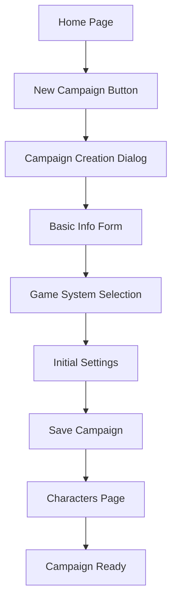
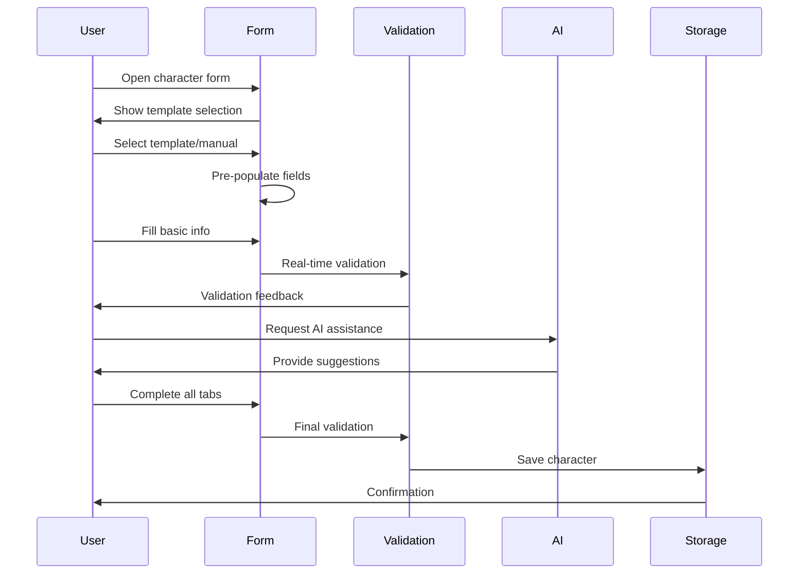
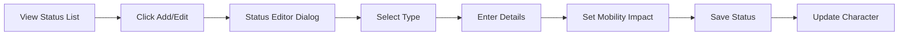
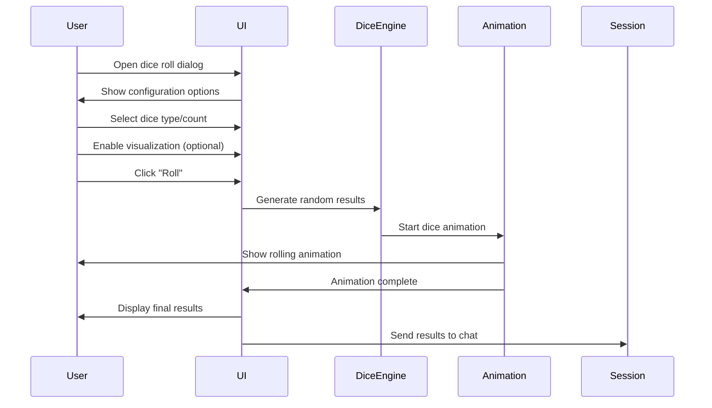
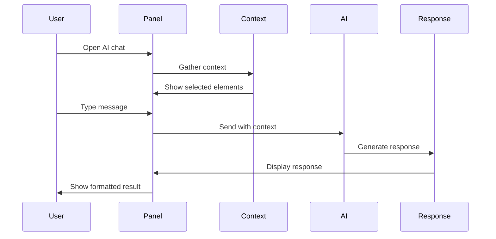
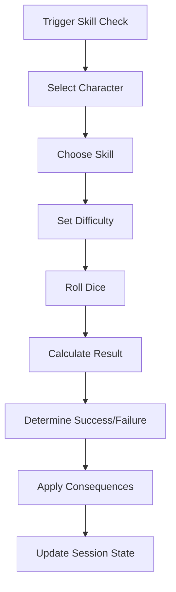
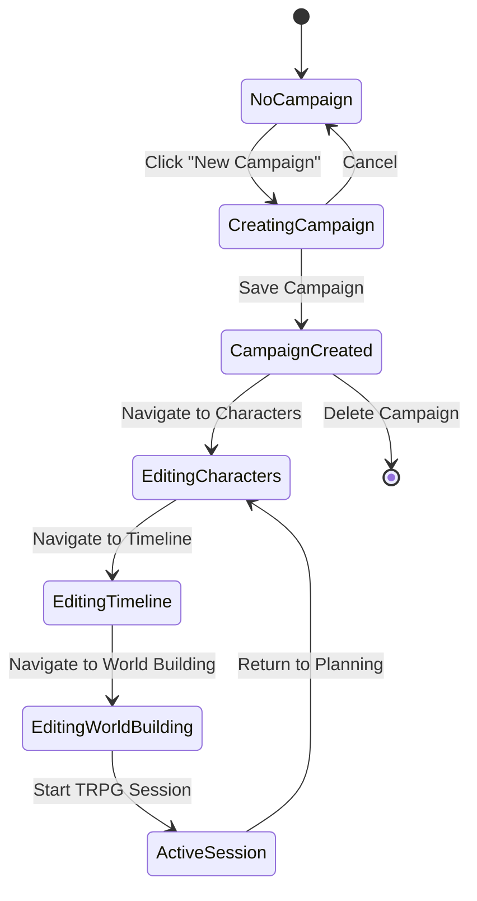
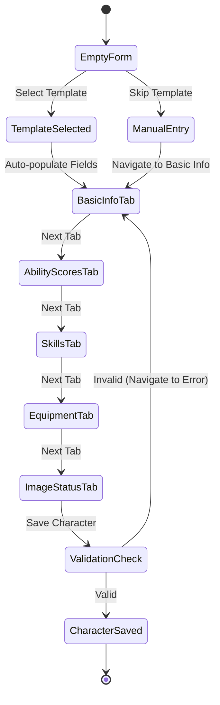
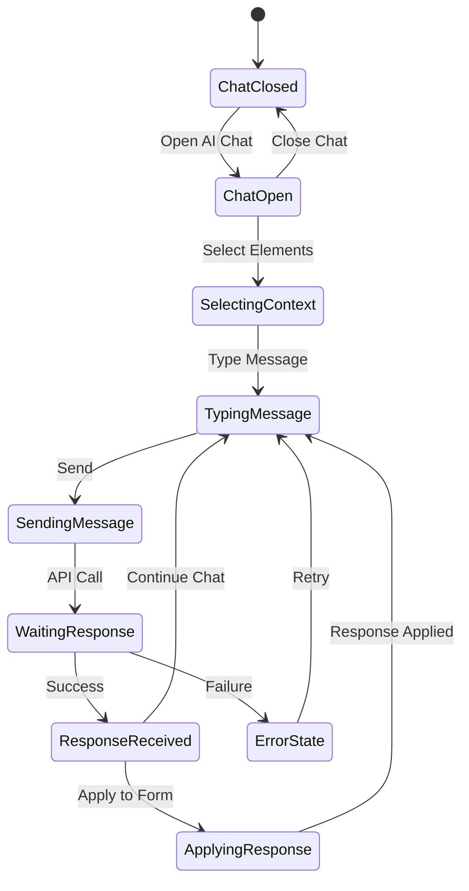
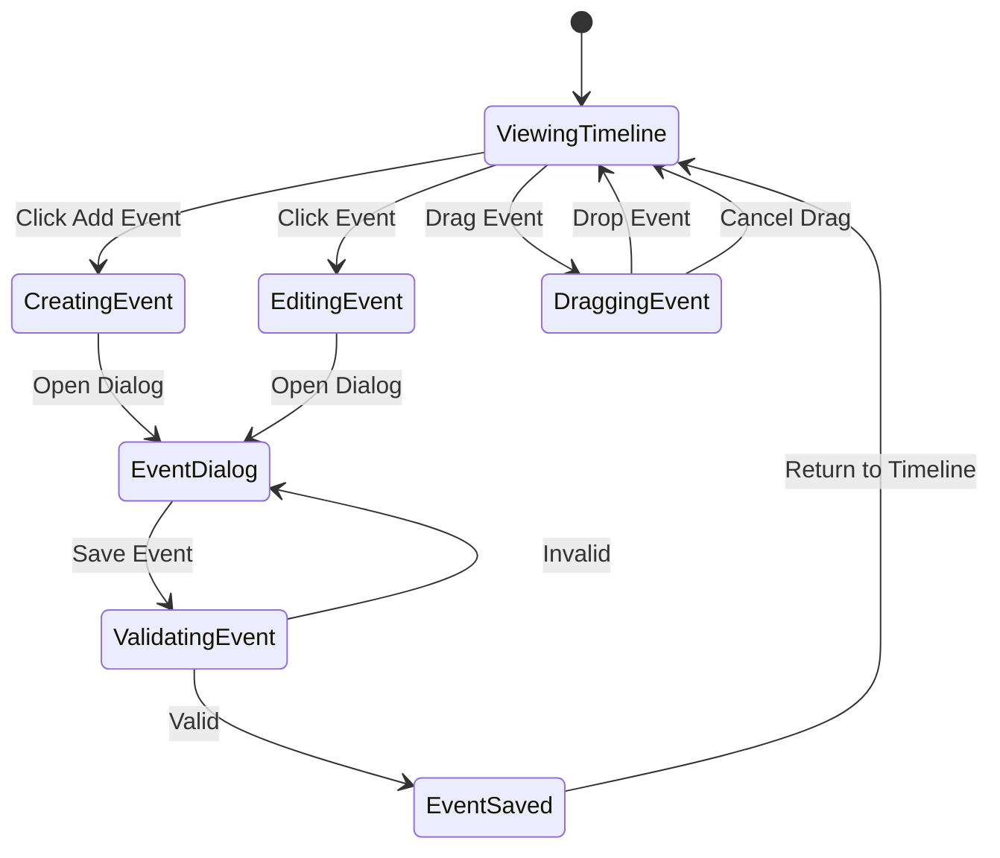

# TRPG Application - Comprehensive Interaction Specification

## Document Overview

This document provides detailed interaction specifications for the AI-powered TRPG (Tabletop Role-Playing Game) campaign management application. It covers all user interactions, state transitions, accessibility patterns, and error handling for both developer and player modes.

## Table of Contents

1. [Global Interaction Patterns](#global-interaction-patterns)
2. [Campaign Management Interactions](#campaign-management-interactions)
3. [Character Management Interactions](#character-management-interactions)
4. [Dice Rolling System Interactions](#dice-rolling-system-interactions)
5. [Timeline and Event Management](#timeline-and-event-management)
6. [AI Chat Integration](#ai-chat-integration)
7. [World Building Interactions](#world-building-interactions)
8. [Session Management](#session-management)
9. [Accessibility and Keyboard Navigation](#accessibility-and-keyboard-navigation)
10. [Mobile and Touch Interactions](#mobile-and-touch-interactions)
11. [Error Handling and State Recovery](#error-handling-and-state-recovery)
12. [State Transition Diagrams](#state-transition-diagrams)

---

## Global Interaction Patterns

### Application Layout Structure

```
┌─────────────────────────────────────────────────────────────┐
│ Header Bar                                                  │
│ [Logo] [Campaign Name] [Settings] [User Menu]              │
├─────────────────┬───────────────────────────────────────────┤
│ Sidebar         │ Main Content Area                         │
│ Navigation      │                                           │
│ [Home]          │ Page-specific content                     │
│ [Characters]    │                                           │
│ [Timeline]      │                                           │
│ [World Build]   │                                           │
│ [Writing]       │                                           │
│ [TRPG Session]  │                                           │
│                 │                                           │
├─────────────────┼───────────────────────────────────────────┤
│ AI Chat Panel   │ Status Bar                                │
│ (Collapsible)   │ [Save Status] [Connection] [Notifications]│
└─────────────────┴───────────────────────────────────────────┘
```

### Navigation Interaction Flow

1. **Sidebar Navigation**
   - **Click**: Navigate to page immediately
   - **Hover**: Show tooltip with page description
   - **Keyboard**: Tab navigation, Enter to select
   - **State**: Active page highlighted with different color
   - **Loading**: Smooth transition with loading indicator

2. **Breadcrumb Navigation**
   - **Click**: Navigate to parent level
   - **Keyboard**: Tab through breadcrumb items
   - **Visual**: Show current path with separators

### Developer Mode Toggle

The application supports two interaction modes:

```
Developer Mode: ON
├── All features visible
├── Advanced options shown
├── Debug information available
└── Complex workflows enabled

Developer Mode: OFF
├── Simplified interface
├── Core features only
├── Guided workflows
└── Beginner-friendly tooltips
```

**Toggle Interaction:**
- Location: Settings panel or header
- Input: Toggle switch with immediate effect
- Feedback: Interface adapts with smooth transitions
- Persistence: Setting saved to localStorage

---

## Campaign Management Interactions

### Campaign Creation Workflow



### Campaign Creation Form Interactions

1. **Campaign Name Input**
   - **Field Type**: Text input with real-time validation
   - **Validation**: 
     - Required field
     - Minimum 3 characters
     - Maximum 50 characters
     - Real-time character counter
   - **Interaction**: 
     - Focus: Border highlight + label animation
     - Blur: Validation message if invalid
     - Error state: Red border + error message below
   - **Keyboard**: Tab navigation, Enter to next field

2. **Game System Selection**
   - **Field Type**: Dropdown with searchable options
   - **Options**: D&D 5e, Pathfinder, Call of Cthulhu, Custom
   - **Interaction**:
     - Click: Open dropdown with smooth animation
     - Search: Filter options as user types
     - Selection: Highlight selected item, close dropdown
   - **Keyboard**: Arrow keys navigation, Enter to select

3. **Description Textarea**
   - **Field Type**: Expandable textarea with AI assistance
   - **Features**:
     - Auto-resize based on content
     - AI autocomplete suggestions
     - Character count (0/500)
   - **Interaction**:
     - Focus: Show AI assist button
     - AI Assist: Open AI chat panel with context
     - Blur: Save draft automatically

### Campaign Settings Management

**Settings Panel Structure:**
```
Campaign Settings
├── Basic Information
│   ├── Name [Edit inline]
│   ├── Description [Expandable editor]
│   └── Game System [Dropdown]
├── Player Management
│   ├── Add Players [Email invitation]
│   ├── Player Permissions [Checkbox matrix]
│   └── Session Scheduling [Calendar widget]
├── AI Configuration
│   ├── AI Provider [Selection]
│   ├── Response Tone [Slider]
│   └── Automation Level [Checkboxes]
└── Export/Import
    ├── Export Campaign [Button]
    ├── Import Data [File upload]
    └── Backup Settings [Toggle]
```

**Interaction Patterns:**
- **Inline Editing**: Double-click to edit, Enter to save, Esc to cancel
- **Modal Dialogs**: For complex settings with multiple fields
- **Confirmation Dialogs**: For destructive actions (delete, reset)
- **Auto-save**: Settings saved after 2-second delay from last change

---

## Character Management Interactions

### Character Sheet Interface

The character form uses a tabbed interface with comprehensive validation:

```
Character Form Tabs:
├── Tab 0: System Templates
├── Tab 1: Basic Information
├── Tab 2: Ability Scores
├── Tab 3: Skills
├── Tab 4: Equipment
└── Tab 5: Image & Status
```

### Character Creation Workflow



### Detailed Tab Interactions

#### Tab 1: Basic Information
1. **Character Name Field**
   - **Input Type**: Text with real-time validation
   - **Validation Rules**:
     - Required field
     - 2-50 characters
     - Unique within campaign
   - **AI Integration**: 
     - Autocomplete suggestions based on race/class
     - Cultural name suggestions
   - **Interaction Flow**:
     ```
     Focus → Show validation status
     Type → Real-time validation
     Blur → Final validation
     Error → Red border + message
     Valid → Green checkmark
     ```

2. **Character Type Selection**
   - **Options**: PC (Player Character), NPC, Enemy
   - **Visual Indicators**:
     - PC: Gold icon (🦸)
     - NPC: Blue icon (👤)
     - Enemy: Red icon (👹)
   - **Dependent Fields**: Player name field appears for PC type
   - **Interaction**: Immediate UI adaptation on selection

3. **Race and Class Fields**
   - **Input Type**: Text with autocomplete suggestions
   - **Suggestions**: Common fantasy races/classes
   - **AI Enhancement**: Context-aware suggestions
   - **Validation**: Required fields with length limits

#### Tab 2: Ability Scores
- **Input Type**: Number inputs with constraints (1-20)
- **Interactive Elements**:
  - Spin buttons for adjustment
  - Keyboard input with validation
  - Derived stats auto-calculation
- **Visual Feedback**: Ability modifier calculations shown in real-time

#### Tab 5: Image & Status Management
1. **Image Upload**
   - **Drag & Drop**: Full drag-and-drop support
   - **File Selection**: Click to open file dialog
   - **Preview**: Immediate image preview
   - **Validation**: File type and size checking
   - **Error Handling**: Clear error messages for invalid files

2. **Emoji Selection**
   - **Grid Layout**: 8x4 emoji grid
   - **Hover Effects**: Scale animation on hover
   - **Selection**: Visual highlight of selected emoji
   - **Accessibility**: Keyboard navigation support

3. **Status Management**
   - **Status List**: Chip-based display of current statuses
   - **Add Status**: Modal dialog for new status creation
   - **Edit Status**: Click to edit existing status
   - **Delete Status**: Confirmation dialog for deletion

### Character Status System

**Status Types:**
- **Life**: Health, injury, death states
- **Mental**: Emotional, psychological conditions
- **Magical**: Spell effects, enchantments
- **Physical**: Physical conditions, disabilities

**Status Interaction Flow:**


**Status Editor Fields:**
1. **Name**: Text input with validation
2. **Type**: Dropdown selection
3. **Mobility**: Radio buttons (Normal/Slow/Impossible)
4. **Description**: Textarea for details
5. **Duration**: Optional duration setting

---

## Dice Rolling System Interactions

### Dice Rolling Interface Architecture

The dice system supports multiple interaction modes and visual themes:

```
Dice Roll UI Structure:
├── Settings Tab
│   ├── Quick Presets
│   ├── Manual Configuration
│   ├── Visualization Toggle
│   └── Theme Selection
└── Visualization Tab
    ├── 3D Dice Animation
    ├── 2D Dice Display
    └── Results Summary
```

### Dice Rolling Workflow



### Dice Configuration Interactions

1. **Quick Presets**
   - **Layout**: Grid of preset buttons
   - **Presets**: d20, Attack Roll, Damage(1d6), Damage(1d8), Ability Score, Initiative
   - **Interaction**: 
     - Click: Instantly configure dice
     - Hover: Show tooltip with description
   - **Visual**: Highlighted selection

2. **Manual Configuration**
   - **Dice Count**: Dropdown (1-20)
   - **Dice Type**: Dropdown (d4, d6, d8, d10, d12, d20, d100)
   - **Modifier**: Number input (-10 to +10)
   - **Purpose**: Text input for roll description
   - **Real-time Preview**: Shows dice notation (e.g., "2d6+3")

3. **Visualization Controls**
   - **Toggle Switch**: Enable/disable 3D animation
   - **Theme Selector**: When visualization enabled
     - Classic, Neon, Stone, Metal, Wood themes
     - Preview thumbnails for each theme
   - **Performance**: Auto-disable on low-end devices

### Dice Animation System

**Animation States:**
1. **Idle**: Dice at rest with subtle hover effects
2. **Rolling**: Spinning animation with physics
3. **Settling**: Gradual slowdown to final result
4. **Complete**: Final value display with emphasis

**Interaction Controls:**
- **Skip Animation**: ESC key or click to fast-forward
- **Repeat Roll**: Button to roll again with same settings
- **History**: Previous roll results displayed

### Dice Results Handling

**Result Display:**
- Individual dice results
- Total with modifiers
- Roll purpose/description
- Timestamp

**Session Integration:**
- Results automatically sent to session chat
- Integration with skill checks and combat
- Character-specific roll attribution

---

## Timeline and Event Management

### Timeline Interface Structure

```
Timeline Page Layout:
├── Timeline Chart (Main Area)
│   ├── Time Columns (Day 1, Day 2, etc.)
│   ├── Place Rows (Locations)
│   ├── Event Cards (Draggable)
│   └── Grid Interaction Area
├── Event Controls (Sidebar)
│   ├── Add Event Button
│   ├── Event Type Filter
│   ├── Character Filter
│   └── Search/Sort Options
└── Event Details Panel
    ├── Event Information
    ├── Character Status Changes
    └── Related Plot Elements
```

### Timeline Interaction Patterns

#### Drag and Drop System
1. **Event Creation**
   - **Source**: Event seed list or "Add Event" button
   - **Target**: Timeline grid cells
   - **Visual Feedback**: 
     - Drag helper shows event preview
     - Valid drop zones highlighted
     - Invalid zones show red indicator
   - **Snap Behavior**: Events snap to grid cells
   - **Multi-select**: Ctrl+click for multiple events

2. **Event Movement**
   - **Drag**: Click and hold on event card
   - **Drop Zones**: Any valid timeline cell
   - **Constraints**: 
     - Events cannot overlap in same cell
     - Some events have time restrictions
   - **Feedback**: Smooth animation during movement

3. **Event Resizing**
   - **Handle**: Resize handles on event corners
   - **Duration**: Extend events across multiple time periods
   - **Validation**: Ensure logical time constraints

#### Event Dialog Interactions

**Event Creation/Edit Dialog:**
```
Event Dialog Structure:
├── Basic Information
│   ├── Event Name [Required]
│   ├── Day Number [Required]
│   ├── Description [Optional]
│   └── Event Type [Dropdown]
├── Relationships
│   ├── Related Characters [Multi-select]
│   ├── Related Places [Auto-filled]
│   └── Related Plots [Autocomplete]
└── Character Status Changes
    ├── Pre-event Status [Display]
    ├── Post-event Status [Multi-select]
    └── Status Impact [Automatic]
```

**Field Interactions:**
1. **Event Name**: Real-time validation with character count
2. **Day Number**: Number input with min/max constraints
3. **Character Selection**: 
   - Multi-select dropdown with character avatars
   - Chip-based display of selections
   - Delete chips with confirmation
4. **Status Management**: 
   - Before/after status comparison
   - Color-coded status chips
   - Automatic conflict detection

### Event Dependencies and Triggers

**Dependency System:**
- **Prerequisites**: Events that must occur before
- **Consequences**: Events triggered by completion
- **Conditional Events**: Events based on character status
- **Location Triggers**: Events based on character location

**Visual Representation:**
- Dependency lines between events
- Color coding for different relationship types
- Hover effects to highlight relationships

---

## AI Chat Integration

### AI Chat Panel Architecture

```
AI Chat Panel:
├── Header
│   ├── AI Provider Status
│   ├── Model Selection
│   └── Panel Controls
├── Tab Navigation
│   ├── Chat Tab
│   ├── Assist Tab
│   └── Settings Tab
├── Chat Area
│   ├── Message History
│   ├── Context Display
│   └── Selected Elements
└── Input Area
    ├── Message Input
    ├── Send Button
    └── Voice Input (Future)
```

### Chat Interaction Flow



### Context Selection System

**Selectable Elements:**
- Characters (current stats, background)
- Timeline events (details, outcomes)
- Plot elements (story beats, conflicts)
- World building elements (locations, cultures)
- Session notes (previous conversations)

**Selection Interactions:**
1. **Element Selection**: 
   - Click elements to toggle selection
   - Visual highlighting for selected items
   - Context chip display in chat panel
2. **Context Management**:
   - Remove individual context items
   - Clear all context
   - Save context sets for reuse

### AI Assistance Modes

#### 1. General Chat Mode
- **Purpose**: Open-ended conversation with AI
- **Context**: Current campaign and selected elements
- **Response**: Natural language responses
- **Actions**: None (informational only)

#### 2. Assist Mode
- **Purpose**: Specific content generation
- **Context**: Target page and form data
- **Response**: Structured content suggestions
- **Actions**: Apply suggestions to forms

#### 3. Auto-complete Mode
- **Purpose**: Real-time writing assistance
- **Context**: Current field and character data
- **Response**: Completion suggestions
- **Actions**: Accept/reject suggestions

### AI Response Handling

**Response Types:**
1. **Text Responses**: Formatted markdown display
2. **Structured Data**: Forms with apply buttons
3. **Multiple Options**: Choice selection interface
4. **Error Messages**: User-friendly error display

**Response Actions:**
- **Copy to Clipboard**: Copy response text
- **Apply to Form**: Fill form fields with response
- **Regenerate**: Request new response with same prompt
- **Provide Feedback**: Rate response quality

---

## World Building Interactions

### World Building Interface Structure

```
World Building Page:
├── Tab Navigation
│   ├── Setting Overview
│   ├── Geography & Environment
│   ├── Society & Culture
│   ├── History & Legends
│   ├── Magic & Technology
│   ├── Places & Locations
│   ├── Interactive Map
│   ├── Rules & Systems
│   └── Free Fields
├── Tab Content Area
│   ├── Form Fields
│   ├── AI Assist Integration
│   └── Preview Panel
└── Sidebar
    ├── Quick Navigation
    ├── Saved Sections
    └── Templates
```

### World Building Form Interactions

#### Multi-Tab Form System
Each tab contains specific world building aspects with consistent interaction patterns:

1. **Form Fields**:
   - **Text Inputs**: Name, title fields with validation
   - **Textareas**: Description fields with auto-resize
   - **Dropdowns**: Predefined categories and types
   - **File Uploads**: Images and documents

2. **AI Integration**:
   - **AI Assist Buttons**: Per-section content generation
   - **Context Awareness**: Uses previously filled sections
   - **Template Application**: AI-generated starting templates

3. **Validation and Save**:
   - **Auto-save**: Content saved every 30 seconds
   - **Validation**: Real-time field validation
   - **Draft Status**: Visual indication of unsaved changes

#### Interactive Map System

**Map Interface:**
```
Interactive Map:
├── Map Canvas
│   ├── Base Map Image
│   ├── Location Markers
│   ├── Connection Lines
│   └── Zoom/Pan Controls
├── Location Panel
│   ├── Location List
│   ├── Add Location
│   └── Edit Location
└── Tools
    ├── Marker Tools
    ├── Drawing Tools
    └── Measurement Tools
```

**Map Interactions:**
1. **Navigation**:
   - **Pan**: Click and drag to move map
   - **Zoom**: Mouse wheel or zoom controls
   - **Reset**: Button to return to default view

2. **Location Management**:
   - **Add Location**: Click on map to place marker
   - **Edit Location**: Double-click marker to edit
   - **Move Location**: Drag marker to new position
   - **Delete Location**: Right-click context menu

3. **Location Details**:
   - **Name**: Text input with validation
   - **Type**: Dropdown (City, Village, Dungeon, etc.)
   - **Description**: Rich text editor
   - **Connections**: Link to other locations

#### Culture Management System

**Culture Form Structure:**
- **Basic Information**: Name, type, population
- **Social Structure**: Government, hierarchy, values
- **Daily Life**: Customs, traditions, festivals
- **Economy**: Trade, currency, resources
- **Relations**: Attitudes toward other cultures

**Culture List Interactions:**
1. **Add Culture**: Modal dialog with form
2. **Edit Culture**: Inline editing or modal
3. **Delete Culture**: Confirmation dialog
4. **Duplicate Culture**: Copy with modifications
5. **Export Culture**: Generate shareable format

---

## Session Management

### TRPG Session Interface

```
Session Page Layout:
├── Character Display Area
│   ├── Active Characters
│   ├── Character Stats
│   └── Status Indicators
├── Chat Interface
│   ├── Session Chat
│   ├── Dice Roll Results
│   └── System Messages
├── Interaction Panel
│   ├── Dice Rolling
│   ├── Skill Checks
│   ├── Power Checks
│   └── Combat Tools
└── GM Panel
    ├── Session Notes
    ├── NPC Quick Access
    └── Event Triggers
```

### Character Display Interactions

**Character Cards:**
- **Layout**: Grid of character cards with essential info
- **Information**: Name, HP, status, current action
- **Interactions**:
  - Click: Select character for actions
  - Double-click: Open detailed character sheet
  - Right-click: Context menu for quick actions

**Status Management:**
- **Visual Indicators**: Color-coded status effects
- **Status Updates**: Drag and drop status changes
- **Health Tracking**: Visual health bars with animations

### Skill Check System

**Skill Check Workflow:**


**Skill Check Interface:**
1. **Character Selection**: Dropdown or click on character
2. **Skill Selection**: Searchable skill list
3. **Difficulty Setting**: Slider or preset difficulties
4. **Dice Configuration**: Automatic based on character stats
5. **Roll Execution**: Animated dice roll with results
6. **Result Application**: Automatic status updates

### Power Check Mini-Game

**Power Check Mechanics:**
- **Trigger**: Special abilities or magical actions
- **Interface**: Interactive mini-game interface
- **Input Methods**: 
  - Mouse clicks for timing challenges
  - Keyboard sequences for combo moves
  - Touch gestures for mobile users
- **Results**: Success/failure affects narrative and character status

### Combat Management

**Initiative Tracking:**
- **Turn Order**: Visual display of character turn order
- **Current Turn**: Highlighted active character
- **Actions**: Available actions for current character
- **Time Tracking**: Round and turn counters

**Combat Actions:**
1. **Attack**: Target selection and damage calculation
2. **Defend**: Defensive stance modifications
3. **Use Item**: Inventory integration
4. **Cast Spell**: Spell selection and targeting
5. **Move**: Position tracking on battle map

---

## Accessibility and Keyboard Navigation

### Keyboard Navigation Standards

**Global Navigation:**
- **Tab**: Move through interactive elements
- **Shift+Tab**: Move backward through elements
- **Enter/Space**: Activate buttons and links
- **Esc**: Close dialogs and cancel operations
- **Arrow Keys**: Navigate through lists and menus

**Page-Specific Shortcuts:**
```
Home Page:
- Ctrl+N: New campaign
- Ctrl+O: Open campaign
- F2: Rename selected campaign

Character Page:
- Ctrl+N: New character
- Ctrl+S: Save character
- Tab: Navigate form fields
- Ctrl+T: Switch tabs

Timeline Page:
- Ctrl+N: New event
- Arrow Keys: Navigate timeline grid
- Space: Select/deselect events
- Delete: Delete selected events

AI Chat:
- Ctrl+/: Open AI chat
- Ctrl+Enter: Send message
- Esc: Close chat panel
```

### Screen Reader Support

**ARIA Labels and Roles:**
- **Form Fields**: Proper labels and descriptions
- **Buttons**: Action descriptions and states
- **Navigation**: Landmark roles and structure
- **Dynamic Content**: Live regions for updates

**Content Structure:**
- **Headings**: Hierarchical heading structure
- **Lists**: Proper list markup for navigation
- **Tables**: Header associations for data tables
- **Forms**: Fieldset groupings and labels

### High Contrast and Visual Accessibility

**Theme Support:**
- **Light Theme**: Default light color scheme
- **Dark Theme**: High contrast dark mode
- **High Contrast**: Enhanced contrast ratios
- **Reduced Motion**: Disable animations for sensitive users

**Visual Indicators:**
- **Focus Indicators**: Clear focus outlines
- **State Indicators**: Visual state changes
- **Error Indicators**: Clear error highlighting
- **Success Indicators**: Confirmation feedback

### Assistive Technology Integration

**Voice Control:**
- **Voice Commands**: Basic navigation commands
- **Dictation**: Text input via speech
- **Voice Feedback**: Audio confirmations

**Switch Navigation:**
- **Switch Input**: Single-switch scanning
- **Switch Timing**: Configurable scan rates
- **Switch Actions**: Customizable switch functions

---

## Mobile and Touch Interactions

### Responsive Design Breakpoints

```
Breakpoint System:
├── Mobile: 320px - 767px
│   ├── Single column layout
│   ├── Collapsed navigation
│   └── Touch-optimized controls
├── Tablet: 768px - 1023px
│   ├── Two column layout
│   ├── Drawer navigation
│   └── Hybrid touch/mouse
└── Desktop: 1024px+
    ├── Multi-column layout
    ├── Full navigation
    └── Mouse-optimized controls
```

### Touch Gesture Support

**Basic Gestures:**
- **Tap**: Primary selection and activation
- **Double-tap**: Secondary actions (edit, details)
- **Long Press**: Context menus and additional options
- **Swipe**: Navigation and dismissal
- **Pinch/Zoom**: Map and image scaling

**Advanced Gestures:**
- **Two-finger Scroll**: Precise scrolling in lists
- **Three-finger Swipe**: Quick navigation between tabs
- **Pull to Refresh**: Update content in lists
- **Drag and Drop**: Move elements with haptic feedback

### Mobile-Specific Interactions

#### Navigation
- **Hamburger Menu**: Collapsible navigation drawer
- **Bottom Navigation**: Primary actions at thumb reach
- **Floating Action Button**: Context-aware primary actions

#### Form Interactions
- **Keyboard Optimization**: Appropriate input types
- **Touch Targets**: Minimum 44px touch targets
- **Scrolling**: Smooth scrolling with momentum
- **Input Focus**: Automatic scrolling to focused fields

#### Dice Rolling
- **Shake to Roll**: Device motion triggers dice roll
- **Touch Dice**: Tap dice for individual rerolls
- **Gesture Rolling**: Swipe gestures for different dice types

### Performance Considerations

**Touch Responsiveness:**
- **Touch Delay**: Minimize touch response delay
- **Animation**: 60fps animations on touch interactions
- **Feedback**: Immediate visual feedback on touch
- **Debouncing**: Prevent double-taps and rapid inputs

**Memory Management:**
- **Lazy Loading**: Load content as needed
- **Image Optimization**: Responsive images for mobile
- **Caching**: Intelligent caching of frequently accessed data

---

## Error Handling and State Recovery

### Error Categories and Handling

#### Network Errors
**Error Types:**
- Connection timeout
- Server unavailable
- API rate limiting
- Authentication failures

**User Experience:**
- **Graceful Degradation**: Offline functionality where possible
- **Retry Mechanisms**: Automatic retry with exponential backoff
- **User Notification**: Clear error messages with actionable steps
- **Offline Queuing**: Queue actions for when connection returns

#### Validation Errors
**Form Validation:**
- **Real-time Validation**: Immediate feedback on input
- **Field-level Errors**: Specific error messages per field
- **Form-level Errors**: Summary of all validation issues
- **Recovery Guidance**: Suggestions for fixing errors

**Data Validation:**
- **Type Checking**: Ensure data types match expectations
- **Range Validation**: Numeric and date range checking
- **Required Fields**: Clear indication of required information
- **Format Validation**: Email, URL, and custom format checking

#### AI Integration Errors
**AI Service Errors:**
- **API Key Issues**: Clear setup instructions
- **Model Availability**: Fallback to alternative models
- **Response Parsing**: Handle malformed AI responses
- **Rate Limiting**: Queue and retry AI requests

**Error Recovery:**
- **Manual Fallback**: Allow manual completion when AI fails
- **Partial Responses**: Use partial AI responses when available
- **Alternative Providers**: Switch between AI providers
- **Cache Responses**: Reuse previous successful responses

### State Management and Recovery

#### Auto-save System
**Save Triggers:**
- **Time-based**: Save every 30 seconds
- **Action-based**: Save after significant changes
- **Focus-based**: Save when leaving form fields
- **Manual**: Explicit save button actions

**Save Indicators:**
- **Saving State**: Visual indication during save
- **Saved State**: Confirmation of successful save
- **Error State**: Clear indication of save failures
- **Pending State**: Show unsaved changes

#### Session Recovery
**Browser Crash Recovery:**
- **Session Storage**: Preserve form data in session storage
- **Page Reload**: Restore state after page reload
- **Tab Recovery**: Restore state when reopening tabs
- **Cross-device**: Cloud sync for multi-device usage

**Data Integrity:**
- **Conflict Resolution**: Handle concurrent edits
- **Version Control**: Track changes and allow rollback
- **Backup Creation**: Automatic backups of important data
- **Data Validation**: Ensure data consistency on recovery

### User Feedback and Notifications

#### Notification System
**Notification Types:**
- **Success**: Green checkmark for successful actions
- **Warning**: Yellow caution for potential issues
- **Error**: Red alert for failures and problems
- **Info**: Blue information for neutral updates

**Notification Delivery:**
- **Toast Messages**: Temporary notifications for quick feedback
- **Persistent Alerts**: Important messages that require acknowledgment
- **Progress Indicators**: For long-running operations
- **Status Bar**: Continuous status information

#### Help and Support
**Contextual Help:**
- **Tooltips**: Hover help for complex interface elements
- **Help Icons**: Click for detailed explanations
- **Inline Help**: Expandable help sections within forms
- **Video Tutorials**: Embedded tutorial videos

**Support Channels:**
- **Documentation**: Comprehensive user guides
- **FAQ**: Frequently asked questions
- **Community**: User forums and discussions
- **Contact**: Direct support contact options

---

## State Transition Diagrams

### Campaign State Flow



### Character Creation State Flow



### AI Chat Interaction Flow



### Timeline Event Management Flow



## Implementation Guidelines

### Code Organization

**Component Structure:**
```
src/components/
├── common/          # Shared UI components
├── forms/           # Form-specific components
├── navigation/      # Navigation components
├── ai/             # AI integration components
├── character/      # Character management
├── timeline/       # Timeline and events
├── world/          # World building
├── session/        # TRPG session components
└── accessibility/  # Accessibility helpers
```

**Interaction Handlers:**
- **Event Delegation**: Use event delegation for performance
- **Debouncing**: Debounce rapid user inputs
- **State Management**: Centralized state with Recoil
- **Error Boundaries**: React error boundaries for graceful failures

### Testing Interaction Patterns

**Automated Testing:**
- **Unit Tests**: Test individual interaction handlers
- **Integration Tests**: Test interaction flows
- **E2E Tests**: Full user journey testing
- **Accessibility Tests**: Automated accessibility checking

**Manual Testing:**
- **Device Testing**: Test on various devices and screen sizes
- **Browser Testing**: Cross-browser compatibility
- **Accessibility Testing**: Screen reader and keyboard testing
- **Performance Testing**: Interaction responsiveness

### Performance Optimization

**Interaction Performance:**
- **Virtual Scrolling**: For large lists and tables
- **Lazy Loading**: Load components as needed
- **Memoization**: Cache expensive calculations
- **Request Debouncing**: Prevent excessive API calls

**Animation Performance:**
- **Hardware Acceleration**: Use CSS transforms for animations
- **Frame Rate**: Maintain 60fps for smooth interactions
- **Reduced Motion**: Respect user motion preferences
- **Progressive Enhancement**: Fallbacks for low-performance devices

---

## Conclusion

This comprehensive interaction specification provides detailed guidance for implementing user interactions throughout the TRPG application. It ensures consistent, accessible, and performant user experiences across all features and devices.

The specification should be updated as new features are added and user feedback is incorporated. Regular usability testing and accessibility audits should be conducted to maintain the quality of interactions.

For implementation questions or clarifications, refer to the individual component documentation and conduct user testing to validate interaction patterns.