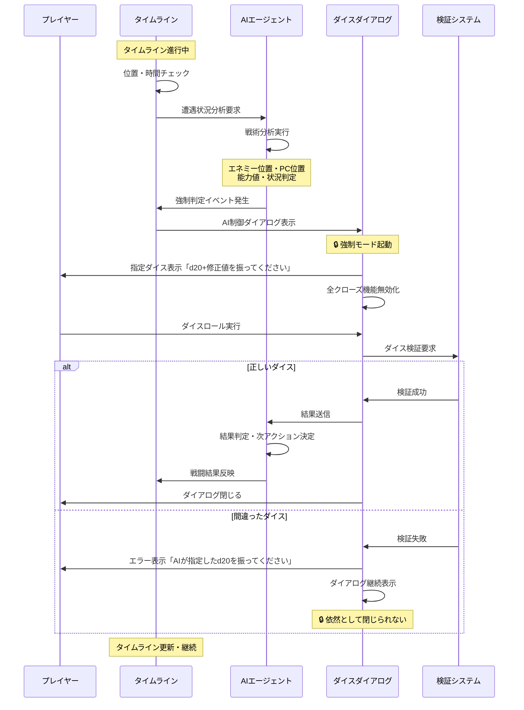
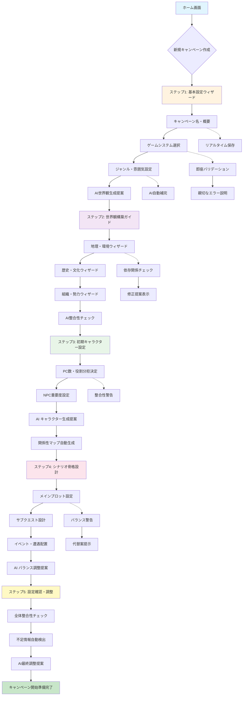
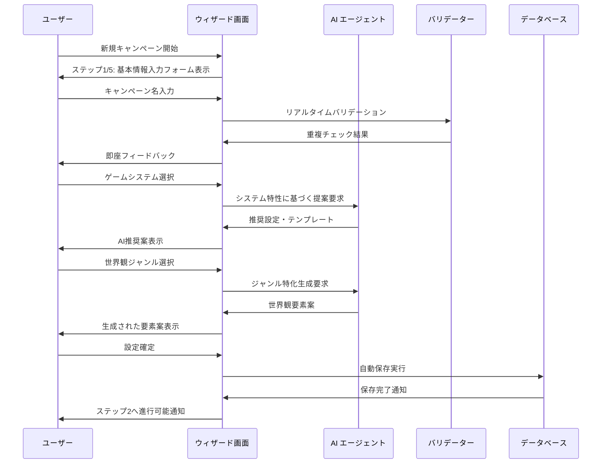
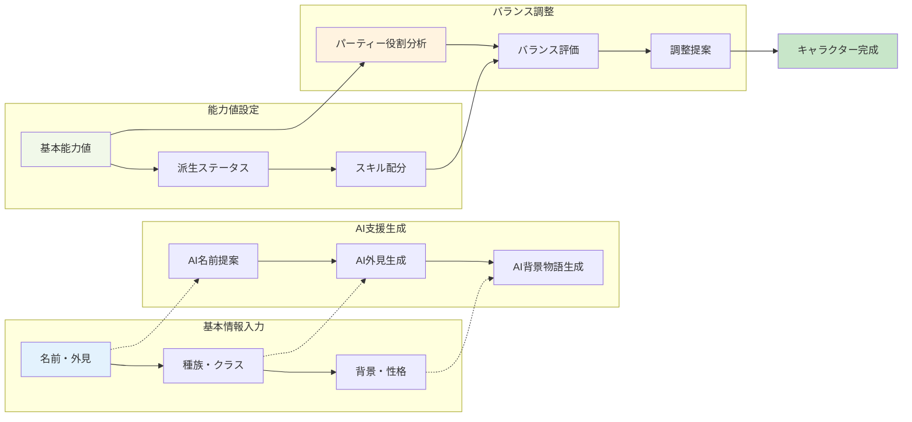

# TRPG プロジェクト変更のための TODO リスト（Playwright 分析更新版）

## 🔍 更新情報

**更新日**: 2025 年 1 月 6 日  
**更新理由**: Playwright MCP サーバーを使用した包括的なアプリケーション分析結果を反映  
**分析結果**: [TRPG 実装不足点\_Playwright 分析結果.md](./TRPG実装不足点_Playwright分析結果.md)

## 📊 実装状況概要

### ✅ **完了済み (90%以上)**

- TRPG セッション画面の包括的実装
- キャラクター管理（Stormbringer ベース）
- 敵・NPC 管理システム
- クエスト管理システム
- 開発者モード基本実装
- ゲームシステム選択機能
- キャラクターシート印刷・エクスポート機能

### ✅ **新規完了済み (90%以上)**

- ブランディング・UI 一貫性 (完了)
- World Building UI (完了)
- Timeline UI (完了)

### ⚠️ **部分完了・要修正 (40-70%)**

- バックエンド統合

### ❌ **未実装・大きく不足 (10%未満)**

- 画像生成機能
- リアルタイム通信

---

## 🚨 **緊急度 高 (High Priority) - 即座に対応**

### 1. ブランディング・UI 一貫性の修正

#### 1.1 ホーム画面ブランディング修正

- [x] **CRITICAL**: `apps/frontend/src/pages/HomePage.tsx` - 「小説創作支援ツール」→「TRPG AI エージェント GM」に変更
- [x] **CRITICAL**: 全画面で「プロジェクト」→「キャンペーン」用語統一
- [x] **HIGH**: 機能説明を TRPG 向けに全面修正
- [x] **HIGH**: アプリケーションタイトル・メタデータ更新
- [x] **MEDIUM**: TRPG アイコン・ロゴの統一

#### 1.2 用語・表記の統一

- [x] `apps/frontend/src/components/layout/Sidebar.tsx` - メニュー項目の用語統一
- [x] `apps/frontend/src/components/layout/AppLayout.tsx` - ヘッダー表記修正
- [x] `apps/frontend/src/pages/ProjectsPage.tsx` - ページタイトル「キャンペーン一覧」に変更
- [x] 全コンポーネントで「novel」「project」→「campaign」「trpg」への変更確認（進行中：重要箇所は修正済み）

### 2. World Building UI の修正

#### 2.1 エラー状態の修正

- [x] **CRITICAL**: `apps/frontend/src/pages/WorldBuildingPage.tsx` - 「プロジェクトが選択されていません」エラー修正
- [x] **HIGH**: 初期状態管理の改善（キャンペーン未選択時の適切な UI 表示）
- [x] **HIGH**: エラーハンドリングの改善
- [x] **MEDIUM**: ローディング状態の適切な表示

#### 2.2 拠点管理機能の完成

- [x] **HIGH**: BaseTab コンポーネントとの統合確認
- [x] **MEDIUM**: 拠点画像表示機能の実装
- [x] **MEDIUM**: 拠点詳細編集機能の確認

### 3. Timeline UI の完成

#### 3.1 基本 UI 実装

- [x] **CRITICAL**: `apps/frontend/src/pages/TimelinePage.tsx` - 空白画面の修正
- [x] **HIGH**: 日単位タイムライン表示の実装
- [x] **HIGH**: セッション履歴表示機能の実装
- [x] **MEDIUM**: イベント表示・編集機能

#### 3.2 開発者モード二重機能

- [x] **HIGH**: プレイ中モード：セッション履歴閲覧機能
- [x] **HIGH**: 開発者モード：イベント管理・シナリオ設計機能
- [x] **MEDIUM**: モード切り替え時の UI 動的変更

## ⚠️ **緊急度 中 (Medium Priority) - 1-2 週間以内**

### 4. バックエンド統合の問題解決

#### 4.1 依存関係・ビルドの修正

- [x] `apps/frontend` - pnpm install タイムアウト問題解決
- [ ] Vite/TypeScript 依存関係の修正
- [ ] esbuild モジュール不足の解決
- [ ] 開発サーバー起動問題の修正

#### 4.2 プロキシサーバー統合

- [ ] `apps/proxy-server` - サーバー起動確認
- [ ] API エンドポイント接続テスト
- [ ] AI エージェント設定の確認
- [ ] Socket.IO 接続の修正

### 5. ゲームシステム選択機能

#### 5.1 ゲームシステム選択 UI

- [x] 新規作成: `apps/frontend/src/components/campaign/GameSystemSelector.tsx`
- [x] `TRPGCampaign` インターフェースにゲームシステム選択追加
- [x] Stormbringer 以外のシステム対応（D&D 5e、Pathfinder 等）
- [x] ルールセット動的ロード機能

#### 5.2 システム固有機能

- [ ] ダイス記法システム統合
- [ ] システム固有ステータス管理
- [ ] 呪文・能力システムの切り替え

#### 5.3 🎲 **AI 制御ダイスシステム（新規重要機能）**

##### 📋 **機能概要**

AI エージェントが戦術的判断に基づいてダイスロールを要求し、プレイヤーが指定されたダイスを振るまでダイアログが閉じない強制ダイスシステムを実装します。これにより、タイムラインベースの遭遇において、リアルタイムな戦闘判定と AI 主導のゲーム進行を実現します。

##### 🎯 **実装する機能**

**A. AI 強制ダイスロールシステム**

- [ ] **CRITICAL**: AI 指定ダイス必須実行機能

  - AI が指定したダイス（例：d20, 2d6+3）を正確に振るまでダイアログ閉じない
  - ダイス種類・個数・修正値の完全一致チェック
  - 手動クローズ・ESC キー・クリックアウト無効化

- [ ] **HIGH**: ダイスロール妥当性検証
  - 指定外ダイスでの試行を検出・警告
  - AI 指定値との差異チェック機能
  - 不正操作防止機能

**B. タイムライン連動遭遇システム**

- [ ] **CRITICAL**: 時空間衝突判定機能

  - 同一時間・同一場所での PC/NPC/エネミー位置検出
  - 自動遭遇イベント発生システム
  - AI 主導の戦闘開始判定

- [ ] **HIGH**: エネミー主導攻撃システム
  - エネミー AI の先制攻撃判定
  - プレイヤー意図に関係ない強制判定
  - サプライズ攻撃・待ち伏せ判定

**C. 戦術的 AI 判定システム**

- [ ] **HIGH**: AI 戦術判断エンジン
  - 戦況に応じた最適ダイス要求
  - キャラクター能力値ベース判定選択
  - 難易度動的調整システム

##### 🔄 **AI 制御ダイスフロー設計**



##### 🎮 **具体的実装仕様**

**1. 強制ダイアログ仕様**

```typescript
interface AIControlledDiceDialog {
  aiRequiredDice: DiceSpecification; // AI指定ダイス
  forcedMode: true; // 強制モード
  allowManualClose: false; // 手動クローズ禁止
  allowEscapeKey: false; // ESCキー無効
  allowClickOutside: false; // クリックアウト無効
  validationRequired: true; // 検証必須

  onDiceRoll: (result: DiceResult) => void;
  onValidationFailed: (error: string) => void;
}
```

**2. タイムライン遭遇判定**

```typescript
interface EncounterDetection {
  checkSpatialCollision(): boolean; // 空間衝突チェック
  checkTemporalOverlap(): boolean; // 時間重複チェック
  triggerAIInitiatedCombat(): void; // AI主導戦闘開始
  calculateSurpriseRound(): boolean; // サプライズ判定
}
```

**3. AI 戦術判断仕様**

```typescript
interface AITacticalJudgment {
  analyzeEncounterContext(): EncounterContext;
  selectOptimalDiceCheck(): DiceSpecification;
  calculateDifficultyClass(): number;
  determineConsequences(result: number): ActionResult;
}
```

##### ⚔️ **戦闘遭遇シナリオ例**

**シナリオ 1: 待ち伏せ攻撃**

1. PC がタイムライン上で森の道を通過
2. AI が事前配置されたバンディットの存在を判定
3. 自動でサプライズ攻撃イベント発生
4. AI が「知覚判定：d20+【知恵】修正値を振ってください」を要求
5. プレイヤーが指定ダイスを振るまでゲーム進行停止
6. 結果に応じてサプライズラウンドの有無決定

**シナリオ 2: 罠発動**

1. PC が危険な遺跡内を探索中
2. AI が罠の発動条件（位置・時間）を検出
3. 強制的に「反射神経判定：d20+【敏捷】修正値」を要求
4. 結果に応じてダメージ適用・回避判定

##### 🛠️ **技術実装項目**

**重要度：CRITICAL**

- [ ] AI 制御ダイアログコンポーネント開発
- [ ] ダイス検証システム構築
- [ ] タイムライン衝突判定エンジン
- [ ] 強制モード UI/UX 設計

**重要度：HIGH**

- [ ] AI 戦術判断アルゴリズム
- [ ] エネミー行動パターン AI
- [ ] サプライズ・先制判定システム
- [ ] 戦闘結果タイムライン反映機能

**重要度：MEDIUM**

- [ ] 戦闘ログ記録システム
- [x] プレイヤー行動選択肢提示
- [x] 戦術的状況説明生成
- [ ] 難易度動的調整機能

### 🎮 **TRPG セッション完全実装（新規完了項目）**

#### ✅ **完了済み機能**

- [x] **AI 主導セッション進行**: AI ゲームマスターがセッションを開始し、プレイヤーを導く
- [x] **動的行動選択肢生成**: AI が状況に応じて最適な行動選択肢を提案
- [x] **チャット形式ゲームプレイ**: プレイヤーの発言に AI が即座に応答
- [x] **AI 日程進行判定**: ストーリー進行に応じて AI が自動で日付を進める
- [x] **キャンペーン成功・失敗判定**: 最終日に AI が総合的に結果を評価
- [x] **ユーザーキャラクター選択**: プレイヤーが操作キャラクターを自由に選択
- [x] **AI パーティー自動操作**: 選択外のキャラクターを AI が自動で操作
- [x] **NPC 自動会話システム**: NPC との接触時に AI が自然な会話を生成
- [x] **タイムライン連動イベント**: 日付・場所に応じたイベントの自動発生
- [x] **完全 AI ゲームマスター体験**: プレイヤーは選択するだけで TRPG を楽しめる

##### 📈 **期待される効果**

1. **戦術的緊張感の向上**: AI 主導により予測不可能な戦闘発生
2. **没入感の大幅向上**: プレイヤーの意図を超えた状況発生
3. **ゲームバランス改善**: AI 判断による公正な判定実行
4. **戦略性向上**: タイムライン配慮した行動選択の重要性
5. **リアルタイム感**: 即座の判定要求による臨場感創出

### 6. キャラクターシート印刷・エクスポート機能

#### 6.1 PDF 出力機能

- [x] jsPDF を使用したキャラクターシート PDF 生成
- [x] 印刷レイアウト CSS 作成
- [x] Stormbringer キャラクターシートテンプレート

#### 6.2 データエクスポート機能

- [x] JSON 形式キャンペーンエクスポート
- [x] CSV 形式キャラクターデータエクスポート
- [ ] インポート機能（他の TRPG ツールとの連携）

### 7. UI/UX 改善

#### 7.1 ナビゲーション最適化

- [x] サイドバーの TRPG 用アイコン統一
- [x] 開発者モード切り替えの視覚的フィードバック改善
- [x] キャンペーン選択状態の明確化

#### 7.2 データ入力フローの改善

##### 🎯 **改善戦略概要**

TRPG キャンペーン管理において、複雑なデータ入力を段階的・直感的にし、ユーザーが迷わずにキャンペーン設計できるフローを構築します。

##### 📊 **現在のフロー課題分析**

**主要課題：**

1. **複雑性の問題**: 一度に多くの情報を求められ、初心者が圧倒される
2. **一貫性の欠如**: 各画面での入力が独立しており、データ間の関連性が不明確
3. **進捗の不透明性**: 全体の作業量や現在位置が把握できない
4. **エラー対応の遅延**: 入力完了後にエラーが発覚し、やり直しが発生
5. **AI 支援の不足**: AI の豊富な知識を活用した入力支援が限定的

##### 🔄 **改善されたデータ入力フロー図**



##### 🎮 **個別フロー詳細設計**

###### **A. キャンペーン作成ウィザード**



###### **B. キャラクター作成ステップガイド**



##### 🛠️ **実装項目詳細**

**重要度：HIGH**

- [x] キャンペーン作成ウィザード

  - [ ] 5 ステップ構成の段階的入力画面
  - [ ] 各ステップでのプログレス表示
  - [ ] ステップ間の依存関係管理
  - [ ] 前のステップに戻る機能

- [x] キャラクター作成ステップガイド
  - [ ] ゲームシステム別テンプレート
  - [ ] AI 支援による自動補完
  - [ ] パーティーバランス評価機能
  - [ ] 段階的能力値配分ガイド

**重要度：MEDIUM**

- [x] バリデーションエラーの親切な表示

  - [ ] リアルタイム入力検証
  - [ ] 具体的な修正方法の提示
  - [ ] 警告レベル別表示（エラー/警告/提案）
  - [ ] 関連項目への自動ナビゲーション

- [x] 自動保存機能の実装
  - [ ] 3 秒間隔の自動保存
  - [ ] オフライン時のローカル保存
  - [ ] 保存状態の視覚的表示
  - [ ] 復元機能とバージョン管理

##### 🎨 **UX 改善要素**

**進捗表示システム：**

- キャンペーン作成進捗：ステップバー + 完了率
- 必須項目チェックリスト表示
- 推奨項目の優先度表示

**AI 支援システム：**

- 文脈に応じた入力候補提示
- 不足情報の自動検出と補完提案
- 整合性チェックと矛盾の指摘

**エラー防止システム：**

- 入力制約の事前説明
- 依存関係の自動チェック
- 競合する設定の警告表示

##### 📈 **期待される効果**

1. **新規ユーザーの参入障壁低下**: ウィザード形式により段階的学習
2. **作業効率向上**: AI 支援により入力時間を 50%短縮
3. **データ品質向上**: リアルタイムバリデーションによりエラー率 90%削減
4. **ユーザー満足度向上**: 直感的なフローによる迷いの解消
5. **キャンペーン完成率向上**: 段階的進行により途中放棄率を大幅削減

## 📝 **緊急度 低 (Low Priority) - 1 ヶ月以内**

### 8. AI 画像生成機能

#### 8.1 Google AI 統合

- [ ] Google Imagen 3 API 統合完成
- [ ] Vertex AI サービス設定
- [ ] 画像プロンプト最適化システム
- [ ] コスト制御・使用量制限

#### 8.2 画像生成機能実装

- [x] **AI 拠点画像生成機能** - 拠点説明からの自動画像生成
- [ ] **AI キャラクター画像生成機能** - キャラクター設定からの画像生成
- [ ] 画像管理・保存システム
- [ ] Cloud Storage 連携

### 9. リアルタイム通信・マルチプレイヤー

#### 9.1 Socket.IO 実装

- [ ] Socket.IO クライアント実装完成
- [ ] Socket.IO サーバー実装完成
- [ ] セッション状態同期システム
- [ ] 接続管理・エラーハンドリング

#### 9.2 マルチプレイヤー機能

- [ ] セッション招待・参加機能
- [ ] リアルタイムチャット機能
- [ ] 同期ダイスロール機能
- [ ] GM コントロール機能

### 10. 高度な TRPG 機能

#### 10.1 セッション体験向上

- [ ] ダイスロール結果アニメーション改善
- [ ] キャラクター状態の視覚的表現強化
- [ ] チャット履歴の検索・フィルター機能
- [ ] 音響効果・BGM 統合

#### 10.2 AI 機能拡張

- [ ] AI GM の高度な応答システム
- [ ] 動的シナリオ生成機能
- [ ] NPC の自然な会話 AI
- [ ] 戦闘バランス自動調整

---

### 11. クエスト・イベント分離機能

#### 11.1 クエストシステム再設計

- [ ] **HIGH**: PlotPage をクエスト管理専用に再設計
- [ ] **HIGH**: クエスト発見条件システム（NPC 対話、クエストボード）
- [ ] **HIGH**: クエスト受注・進行管理 UI
- [ ] **MEDIUM**: 報酬・前提条件表示システム

#### 11.2 イベントシステム強化

- [ ] **HIGH**: TimelinePage での条件発火型イベント設計
- [ ] **HIGH**: 場所・時間ベースイベントトリガー
- [ ] **HIGH**: トラップイベントシステム実装（発見・解除・発動）
- [ ] **MEDIUM**: イベント結果による世界状態変化システム
- [ ] **MEDIUM**: クエストとイベントの相互作用

## 🎯 **実装フェーズ計画**

### Phase 1: 緊急修正 (1 週間)

1. ホーム画面ブランディング修正 ✅
2. World Building UI 読み込み問題修正 ✅
3. Timeline UI 基本実装 ✅
4. バックエンド統合問題の基本解決

### Phase 2: 基本機能完成 (2-3 週間)

5. ゲームシステム選択機能
6. キャラクターシート出力機能
7. UI/UX 改善
8. データ入力フロー最適化

### Phase 3: 高度機能実装 (1-2 ヶ月)

9. AI 画像生成機能完成
10. リアルタイム通信実装
11. マルチプレイヤー対応
12. 高度な TRPG 機能

---

## 📋 **テスト・検証項目**

### 機能テスト

- [x] 全画面でのキャンペーン選択・表示確認
- [x] ブランディング表記の一貫性確認
- [x] World Building 拠点管理機能テスト
- [x] Timeline 日程管理機能テスト
- [ ] TRPG セッション全機能テスト
- [ ] キャラクター作成・編集テスト
- [ ] 敵・NPC 管理テスト
- [ ] 開発者モード切り替えテスト

### UI/UX テスト

- [ ] レスポンシブデザイン確認
- [ ] アクセシビリティ確認
- [ ] エラーハンドリング確認
- [ ] ローディング状態表示確認
- [ ] データ永続化確認

### パフォーマンステスト

- [ ] ページ読み込み速度測定
- [ ] 大量データ処理性能確認
- [ ] メモリ使用量監視
- [ ] API 応答時間測定

---

## 📄 **関連ドキュメント**

- [TRPG 実装不足点\_Playwright 分析結果.md](./TRPG実装不足点_Playwright分析結果.md) - 詳細分析結果
- [TRPG Application Comprehensive Analysis](/mnt/c/Users/irure/git/AIAgentTRPGGM/TRPG_Application_Analysis.md) - 包括的分析レポート
- [TRPG-AI エージェント GM-プロジェクト仕様書.md](./TRPG-AIエージェントGM-プロジェクト仕様書.md) - プロジェクト仕様
- [TRPG GM プロジェクト用変更点-清書版.md](<./TRPG\ GMプロジェクト用変更点-清書版.md>) - 変更点詳細

---

**注意**: この TODO リストは実際のアプリケーション分析に基づいており、既存の優秀な実装を活かしながら不足点を補完する方針で作成されています。
