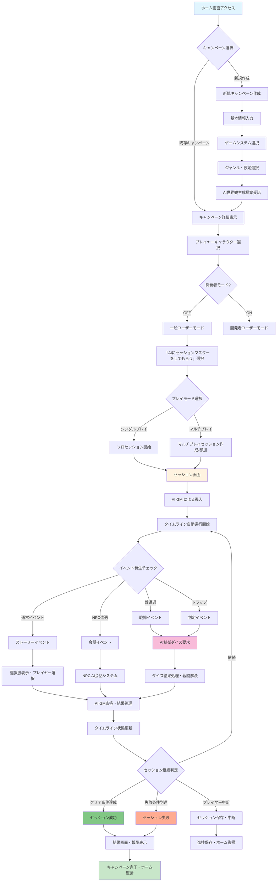
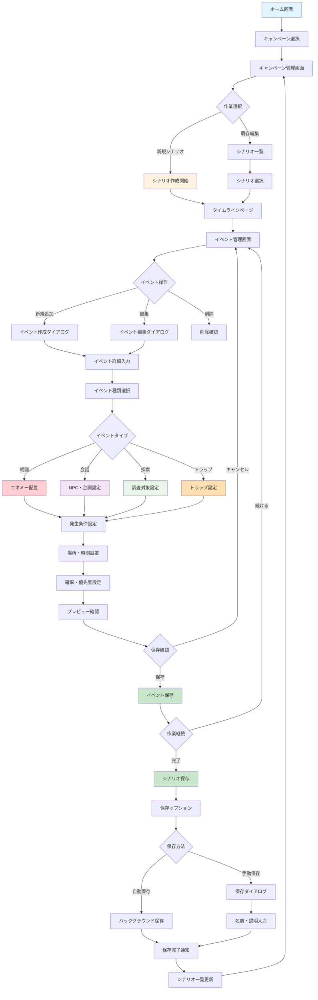
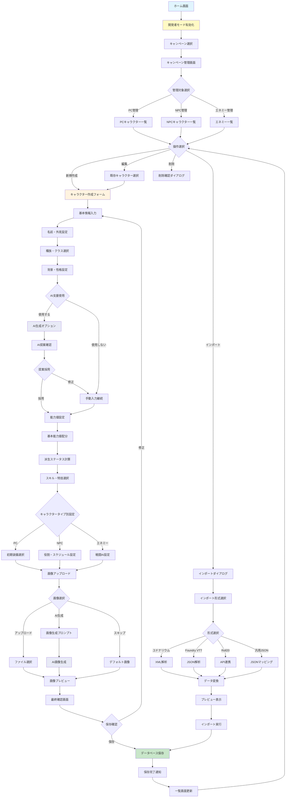
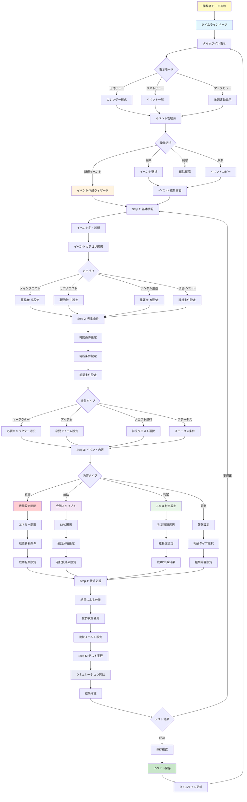
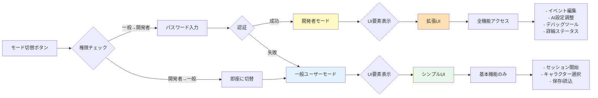
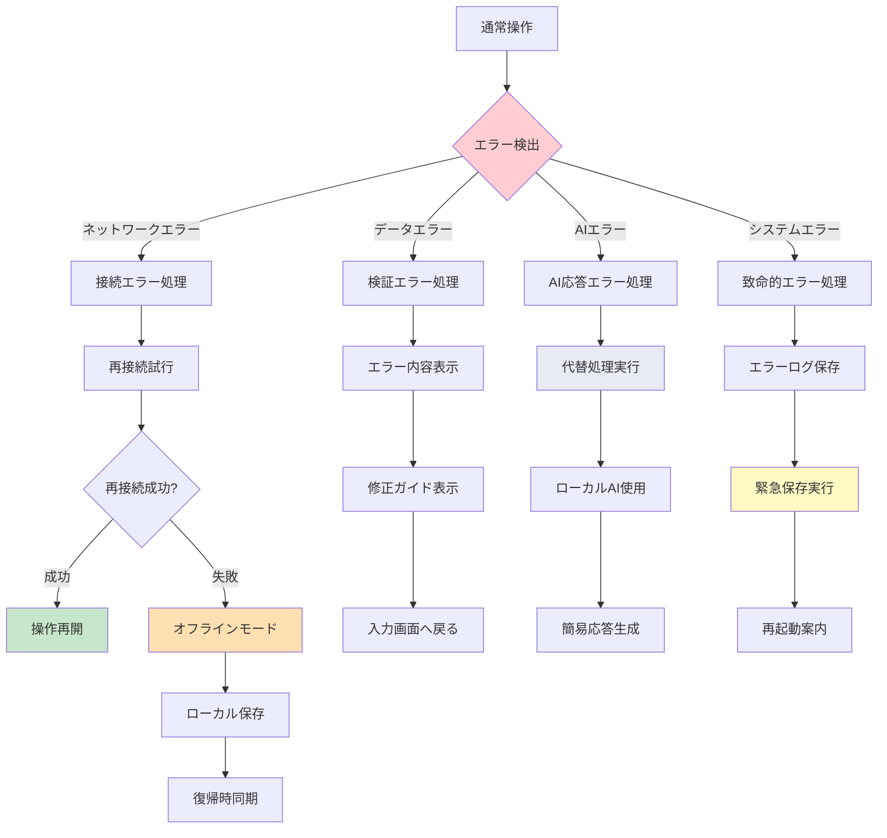
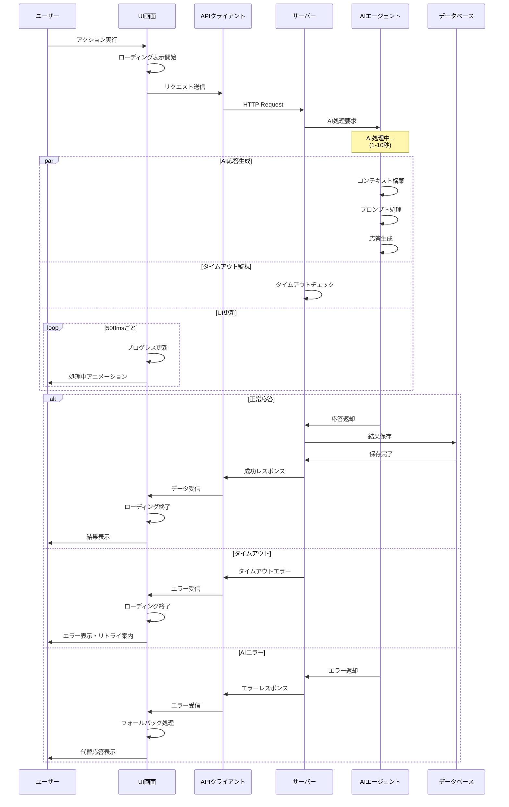
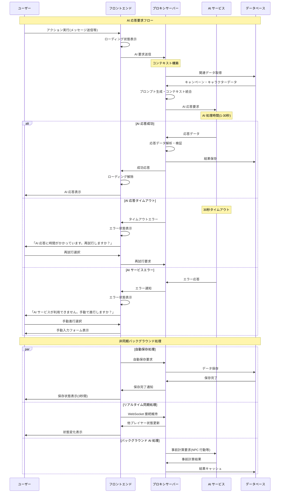
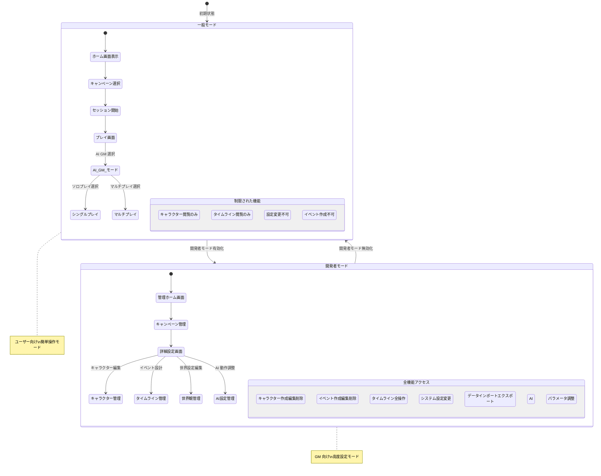

# ユーザー操作ワークフロー図

## 概要

TRPG AI エージェント GM システムにおけるユーザー操作の標準的なワークフローを図解し、E2E テスト設計とユーザビリティ向上のための参考資料として提供します。

## 📋 目次

1. [一般ユーザー: セッション開始からクリアまでのフロー](#1-一般ユーザー-セッション開始からクリアまでのフロー)
2. [一般ユーザー: シナリオ作成・保存フロー](#2-一般ユーザー-シナリオ作成保存フロー)
3. [開発者ユーザー: キャラクター管理フロー](#3-開発者ユーザー-キャラクター管理フロー)
4. [開発者ユーザー: タイムライン・イベント管理フロー](#4-開発者ユーザー-タイムラインイベント管理フロー)
5. [エラー状態・例外処理フロー](#5-エラー状態例外処理フロー)
6. [AI応答待機・非同期処理フロー](#6-ai応答待機非同期処理フロー)
7. [モード切り替え時のUI動的変更フロー](#7-モード切り替え時のui動的変更フロー)

---

## 1. 一般ユーザー: セッション開始からクリアまでのフロー



## 2. 一般ユーザー: シナリオ作成・保存フロー



## 3. 開発者ユーザー: キャラクター管理フロー



## 4. 開発者ユーザー: タイムライン・イベント管理フロー



## 🔄 モード切り替えによる UI 変化



## 📊 エラー処理・例外フロー



## 🎮 AI 応答待機・非同期処理フロー



---

## 5. エラー状態・例外処理フロー

```mermaid
flowchart TD
    A[ユーザー操作実行] --> B{エラー検出}
    
    B -->|通信エラー| C[ネットワークエラー処理]
    B -->|バリデーションエラー| D[入力検証エラー処理]
    B -->|AI応答エラー| E[AI サービスエラー処理]
    B -->|データ保存エラー| F[ストレージエラー処理]
    B -->|セッションエラー| G[セッション状態エラー処理]
    
    C --> C1[接続状態確認]
    C1 --> C2[自動再試行(3回)]
    C2 --> C3{再試行成功?}
    
    C3 -->|成功| H[正常処理継続]
    C3 -->|失敗| I[オフラインモード提案]
    
    D --> D1[エラー箇所ハイライト]
    D1 --> D2[具体的修正方法表示]
    D2 --> D3[関連ヘルプ表示]
    D3 --> J[ユーザー修正待ち]
    
    E --> E1[AI サービス状態確認]
    E1 --> E2[代替 AI プロバイダー試行]
    E2 --> E3{代替成功?}
    
    E3 -->|成功| H
    E3 -->|失敗| K[AI 機能一時無効化]
    
    F --> F1[ローカル保存試行]
    F1 --> F2[自動バックアップ確認]
    F2 --> F3[データ復旧オプション提示]
    
    G --> G1[セッション状態診断]
    G1 --> G2[状態復元試行]
    G2 --> G3{復元成功?}
    
    G3 -->|成功| H
    G3 -->|失敗| L[セッション再開オプション]
    
    I --> M[ローカル機能のみ利用]
    J --> N[入力修正後再実行]
    K --> O[マニュアル入力モード]
    F3 --> P[復旧処理実行]
    L --> Q[新規セッション開始 or データ復旧]
    
    M --> R[機能制限通知表示]
    N --> A
    O --> S[AI 無し進行]
    P --> T[保存処理再実行]
    Q --> U[ユーザー選択実行]
    
    R --> H
    S --> H
    T --> H
    U --> H
    
    style A fill:#e1f5fe
    style H fill:#c8e6c9
    style C fill:#ffcdd2
    style D fill:#fff3e0
    style E fill:#f8bbd9
```

## 6. AI応答待機・非同期処理フロー



## 7. モード切り替え時のUI動的変更フロー



## テスト設計への活用

これらのワークフローは以下の E2E テスト設計に活用されます：

### 重要なテストパス
1. **ハッピーパス**: 一般ユーザーのセッション完了フロー
2. **エラーハンドリング**: 各種エラー状態の適切な処理
3. **状態管理**: モード切り替えと保存・復元
4. **AI統合**: AI 応答の非同期処理とタイムアウト処理

### テスト項目抽出
- 各フロー図の分岐点 → テストケース
- エラー状態 → 例外処理テスト
- 非同期処理 → タイミング・パフォーマンステスト
- 状態遷移 → データ整合性テスト

この図に基づいて、包括的な E2E テストスイートを構築し、TRPG システムの品質を保証します。

## 📝 補足説明

### ユーザーモードの違い

- **一般ユーザーモード**: TRPGセッションを楽しむことに特化。複雑な設定は隠蔽され、AIゲームマスターに従ってプレイ
- **開発者モード**: キャンペーン作成、詳細なイベント設定、AIパラメータ調整など、GM向けの全機能にアクセス可能

### 重要な画面遷移ポイント

1. **キャンペーン選択**: 全ての操作の起点
2. **セッション開始**: シングル/マルチプレイの分岐点
3. **イベント発生**: ゲーム進行の中核
4. **保存タイミング**: 自動保存と手動保存の使い分け

### エラー処理の優先順位

1. データの保護（緊急保存）
2. ユーザー体験の維持（代替処理）
3. 復旧可能性の確保（ログ・状態保存）
4. 明確なフィードバック（エラーメッセージ）