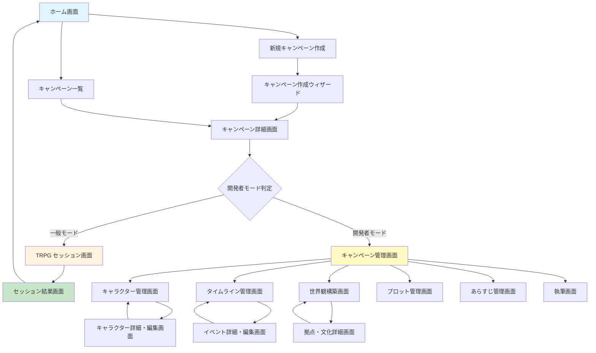
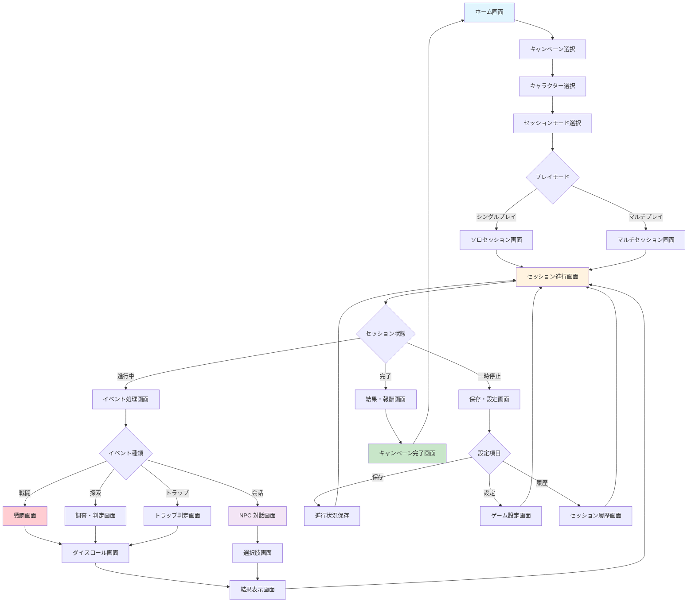

# 画面遷移図

## 概要

TRPG AI エージェント GM システムの画面遷移を図解し、ユーザビリティ設計と E2E テスト設計のための参考資料として提供します。

## 全体画面遷移図

## モード別画面構成

### 一般ユーザーモード画面遷移

## テスト観点での重要な遷移

### クリティカルパス
1. **ホーム → キャンペーン選択 → セッション開始 → イベント処理 → セッション完了**
2. **開発者モード → キャラクター作成 → 保存 → セッションで利用**
3. **タイムライン作成 → イベント設定 → セッションでの自動発火**

### エラー復旧パス
1. **エラー発生 → エラー画面 → 再試行 → 正常復帰**
2. **ネットワーク断 → オフラインモード → 再接続 → 同期**
3. **AI エラー → 代替処理 → 手動進行 → AI 復旧**

### 状態管理確認
1. **画面遷移時のデータ保持**
2. **ブラウザリロード時の状態復元**
3. **マルチタブでの状態同期**

この画面遷移図は E2E テストでの画面ナビゲーション設計と、UI/UX の一貫性確保に活用されます。